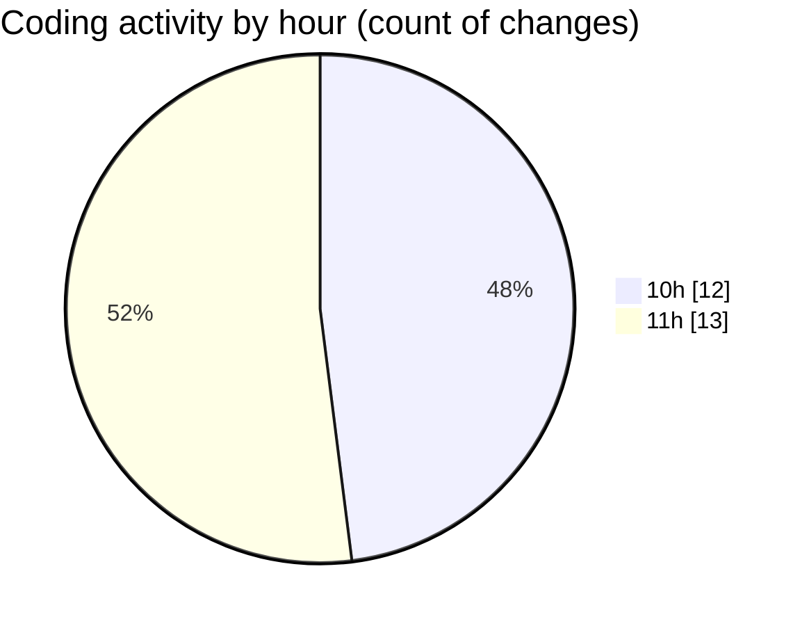

# nxtqube_webapp - Activity Summary 

## Overall Statistics

| Stat                   | Value                                                             |
| ---------------------- | ----------------------------------------------------------------- |
| **Lines Added** (➕)   | 201                                          |
| **Lines Removed** (➖) | 50                                        |
| **Net Change** (↕)    | 151                |
| **Active Time** (⌚)   | 34 minutes |

## Modified Files
- **DroneDefaultsByUser.model.js** (+81, -40)
- **droneFailsafeDefaluts.model.js** (+62, -8)
- **DroneDefaultsByUser.controller.js** (+44, -2)
- **DroneDefaultsByUser.route.js** (+11, -0)
- **routes.js** (+3, -0)

## Visualizations

### By File Type (Lines Changed)

### By Hour (Estimated Activity Count)

> **Last Updated:** 20/06/2025, 11:33:38