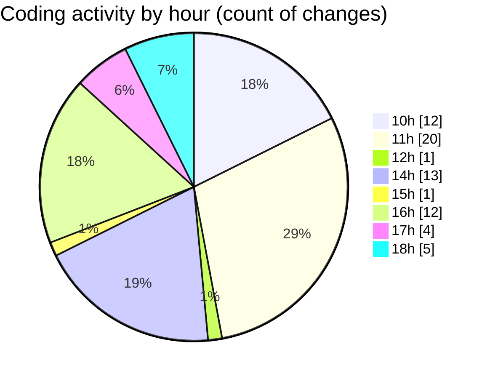

# nxtqube_webapp - Activity Summary 

## Overall Statistics

| Stat                   | Value                                                             |
| ---------------------- | ----------------------------------------------------------------- |
| **Lines Added** (➕)   | 704                                          |
| **Lines Removed** (➖) | 265                                        |
| **Net Change** (↕)    | 439                |
| **Active Time** (⌚)   | 80 minutes |

## Modified Files
- **DroneDefaultsByUser.model.js** (+81, -40)
- **droneFailsafeDefaluts.model.js** (+62, -8)
- **DroneDefaultsByUser.controller.js** (+370, -176)
- **DroneDefaultsByUser.route.js** (+13, -0)
- **routes.js** (+5, -0)
- **ManufacturedDrones.model.js** (+67, -33)
- **drone.model.js** (+20, -0)
- **drone.controller.js** (+2, -2)
- **manufacturedDrones.controller.js** (+68, -0)
- **manufacturedDrones.route.js** (+16, -6)

## Visualizations

### By File Type (Lines Changed)

### By Hour (Estimated Activity Count)

> **Last Updated:** 20/06/2025, 18:47:59