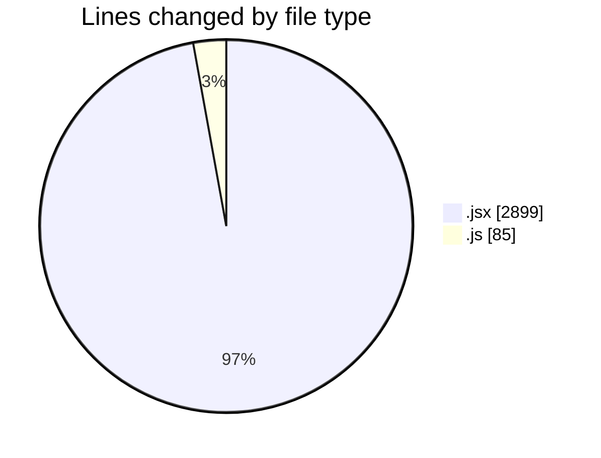
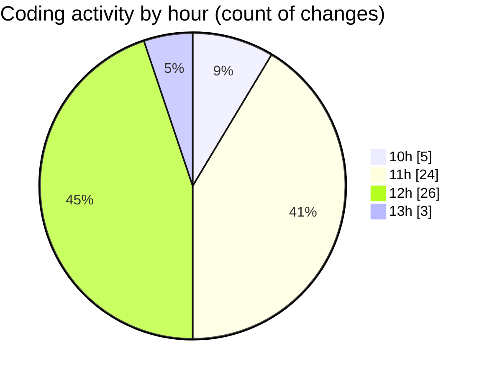

# nxtqube_webapp - Activity Summary 

## Overall Statistics

| Stat                   | Value                                                             |
| ---------------------- | ----------------------------------------------------------------- |
| **Lines Added** (➕)   | 2417                                          |
| **Lines Removed** (➖) | 567                                        |
| **Net Change** (↕)    | 1850                |
| **Active Time** (⌚)   | 73 minutes |

## Modified Files
- **DroneControl.jsx** (+1522, -554)
- **SelectedDronePreview.jsx** (+207, -0)
- **LaunchControl.jsx** (+610, -6)
- **dataGather.js** (+78, -7)

## Visualizations

### By File Type (Lines Changed)

### By Hour (Estimated Activity Count)

> **Last Updated:** 21/06/2025, 13:03:23