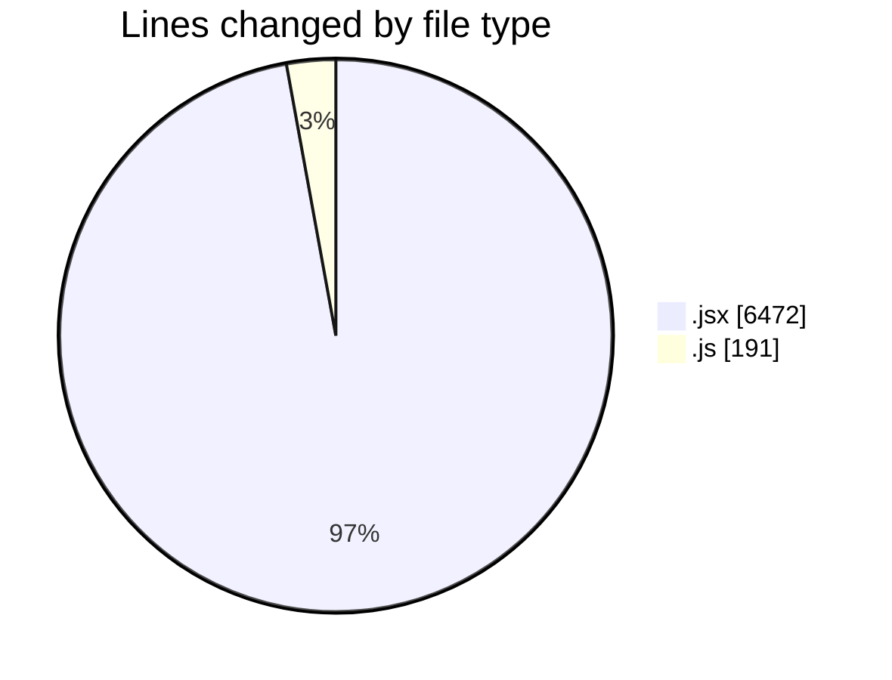
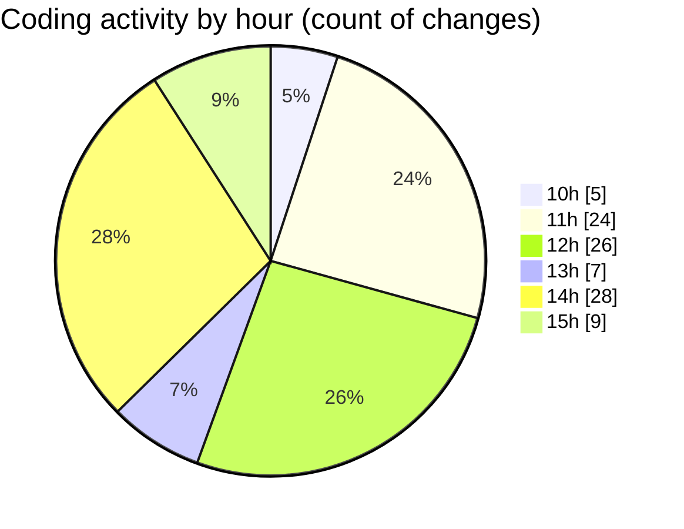

# nxtqube_webapp - Activity Summary 

## Overall Statistics

| Stat                   | Value                                                             |
| ---------------------- | ----------------------------------------------------------------- |
| **Lines Added** (➕)   | 5191                                          |
| **Lines Removed** (➖) | 1472                                        |
| **Net Change** (↕)    | 3719                |
| **Active Time** (⌚)   | 124 minutes |

## Modified Files
- **DroneControl.jsx** (+2403, -1400)
- **SelectedDronePreview.jsx** (+207, -0)
- **LaunchControl.jsx** (+614, -8)
- **dataGather.js** (+78, -7)
- **JoystickControl.jsx** (+901, -0)
- **routes.js** (+88, -18)
- **ExistingMission.jsx** (+741, -3)
- **SettingsContent.jsx** (+159, -36)

## Visualizations

### By File Type (Lines Changed)

### By Hour (Estimated Activity Count)

> **Last Updated:** 21/06/2025, 15:09:56