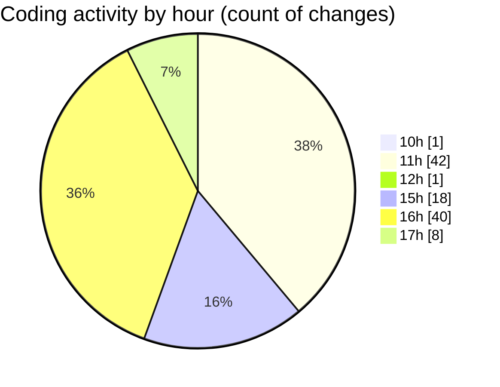

# nxtqube_webapp - Activity Summary 

## Overall Statistics

| Stat                   | Value                                                             |
| ---------------------- | ----------------------------------------------------------------- |
| **Lines Added** (➕)   | 3795                                          |
| **Lines Removed** (➖) | 1926                                        |
| **Net Change** (↕)    | 1869                |
| **Active Time** (⌚)   | 150 minutes |

## Modified Files
- **LaunchControl.jsx** (+628, -0)
- **help.model.js** (+54, -0)
- **help.jsx** (+2074, -1563)
- **addToken.jsx** (+590, -116)
- **helpdesk.jsx** (+449, -247)

## Visualizations

### By File Type (Lines Changed)

### By Hour (Estimated Activity Count)

> **Last Updated:** 25/06/2025, 17:11:29