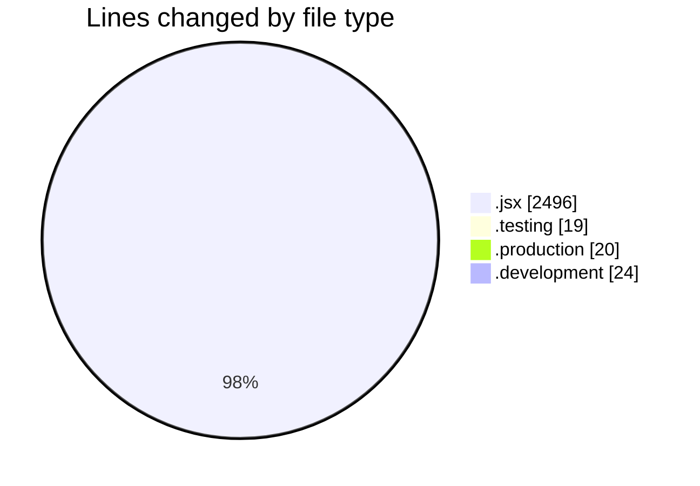
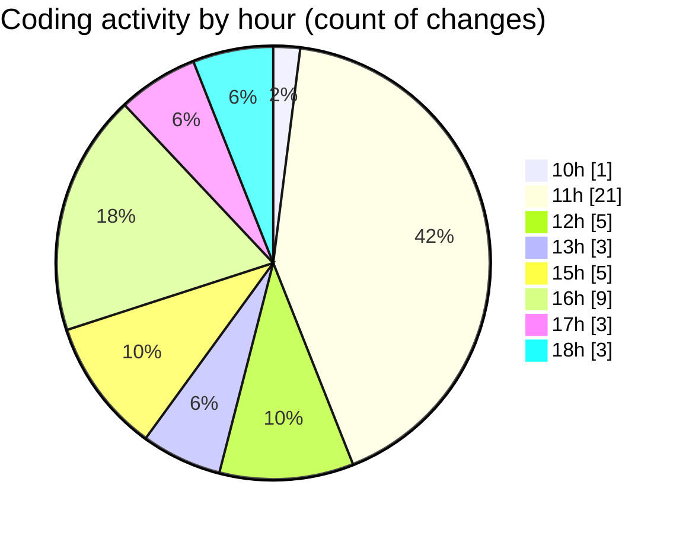

# nxtqube_webapp - Activity Summary 

## Overall Statistics

| Stat                   | Value                                                             |
| ---------------------- | ----------------------------------------------------------------- |
| **Lines Added** (➕)   | 2415                                          |
| **Lines Removed** (➖) | 144                                        |
| **Net Change** (↕)    | 2271                |
| **Active Time** (⌚)   | 58 minutes |

## Modified Files
- **help.jsx** (+27, -34)
- **Map.jsx** (+1917, -108)
- **.env.testing** (+19, -0)
- **.env.production** (+20, -0)
- **.env.development** (+24, -0)
- **DetailedLog.jsx** (+408, -2)

## Visualizations

### By File Type (Lines Changed)

### By Hour (Estimated Activity Count)

> **Last Updated:** 26/06/2025, 18:04:27