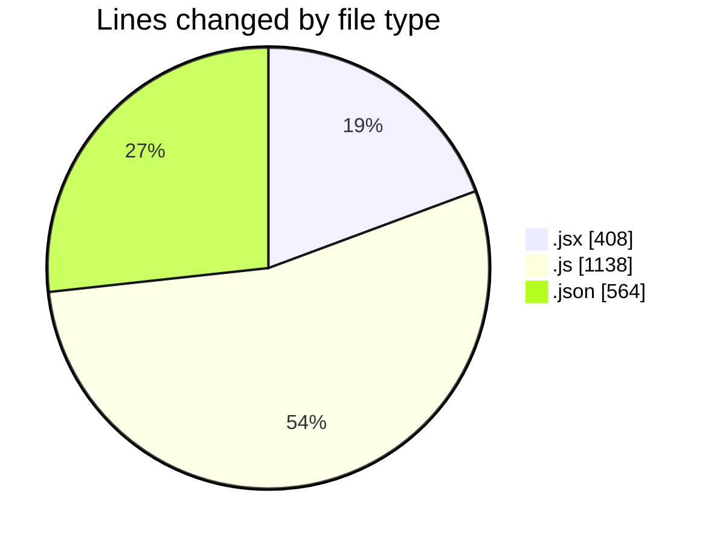
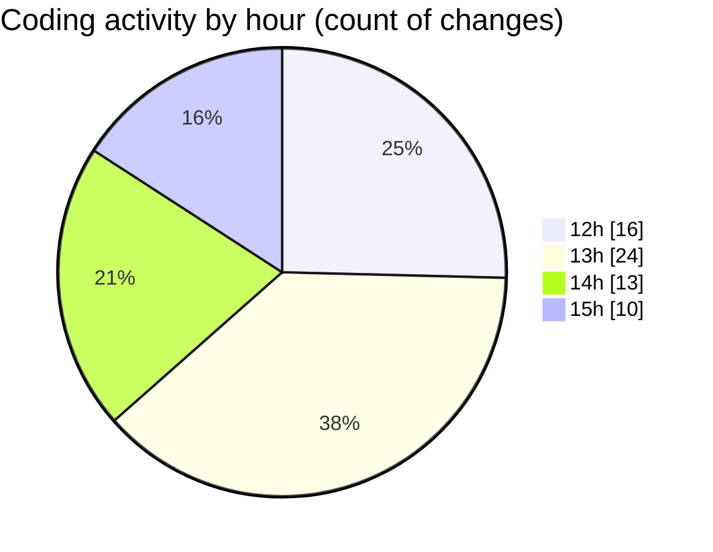

# nxtqube_webapp - Activity Summary 

## Overall Statistics

| Stat                   | Value                                                             |
| ---------------------- | ----------------------------------------------------------------- |
| **Lines Added** (➕)   | 1920                                          |
| **Lines Removed** (➖) | 190                                        |
| **Net Change** (↕)    | 1730                |
| **Active Time** (⌚)   | 75 minutes |

## Modified Files
- **DetailedLog.jsx** (+406, -2)
- **createMissionLogs.js** (+387, -24)
- **enums.json** (+564, -0)
- **drone.model.js** (+155, -65)
- **DroneDefaultsByUser.model.js** (+119, -78)
- **routes.js** (+79, -21)
- **dataProcessor.js** (+210, -0)

## Visualizations

### By File Type (Lines Changed)

### By Hour (Estimated Activity Count)

> **Last Updated:** 27/06/2025, 15:25:34