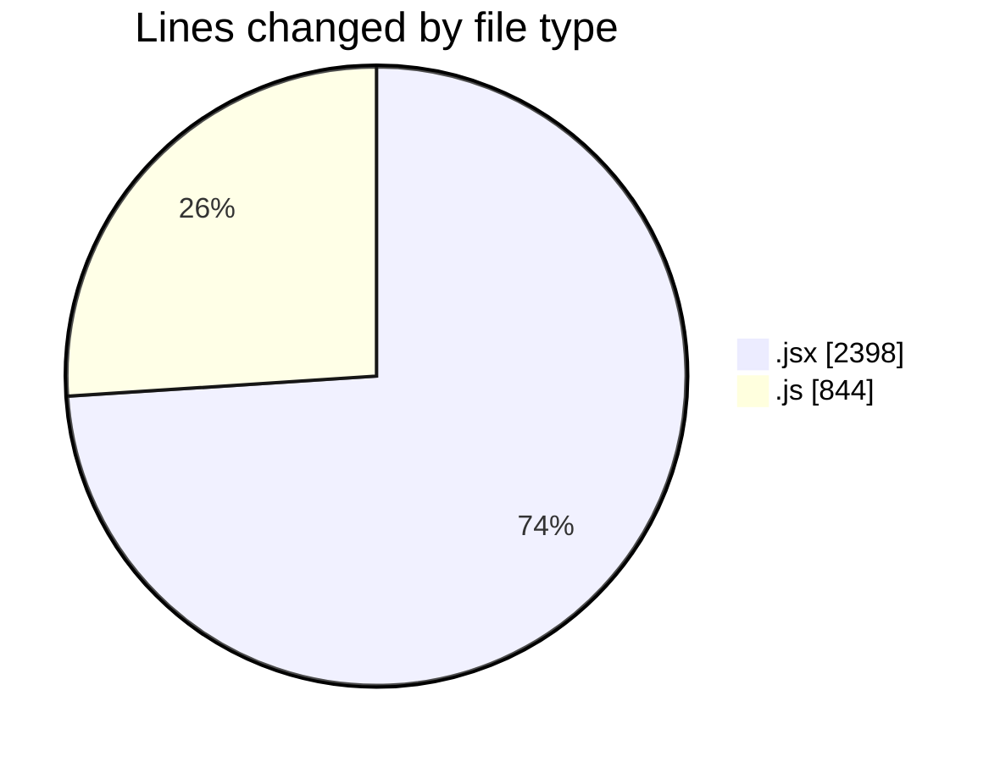
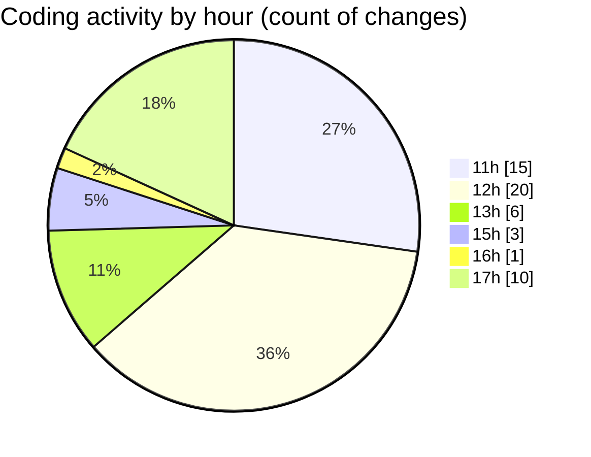

# Argos - Activity Summary 

## Overall Statistics

| Stat                   | Value                                                             |
| ---------------------- | ----------------------------------------------------------------- |
| **Lines Added** (➕)   | 2935                                          |
| **Lines Removed** (➖) | 307                                        |
| **Net Change** (↕)    | 2628                |
| **Active Time** (⌚)   | 59 minutes |

## Modified Files
- **MissionFormDrawer.jsx** (+1281, -0)
- **routes.js** (+9, -0)
- **scheduledMissions.model.js** (+58, -0)
- **scheduledMissions.controller.js** (+318, -159)
- **missionScheduler.js** (+300, -0)
- **DetailedLog.jsx** (+419, -14)
- **ManualControls.jsx** (+367, -133)
- **PlaybackTab.jsx** (+183, -1)

## Visualizations

### By File Type (Lines Changed)

### By Hour (Estimated Activity Count)

> **Last Updated:** 28/06/2025, 17:41:24