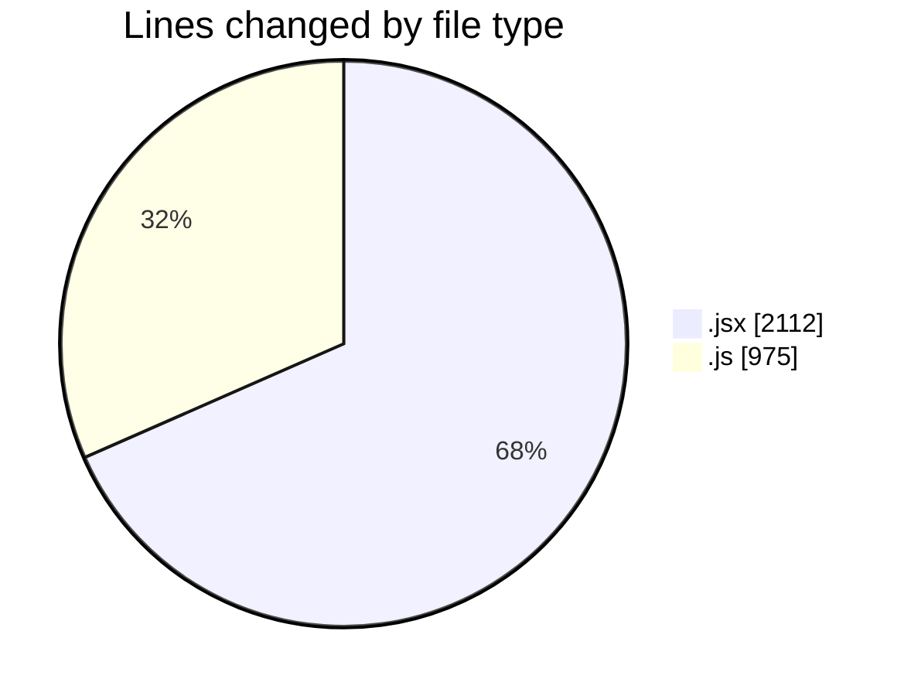
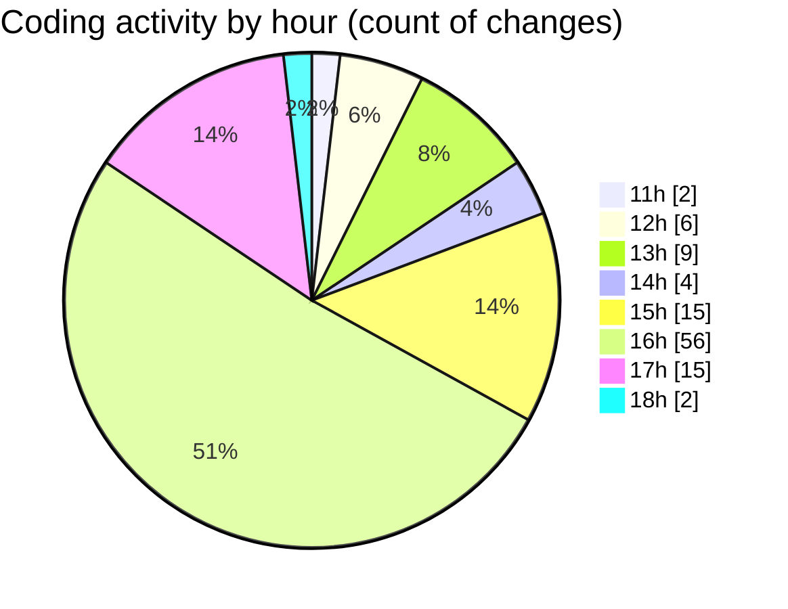

# Argos - Activity Summary 

## Overall Statistics

| Stat                   | Value                                                             |
| ---------------------- | ----------------------------------------------------------------- |
| **Lines Added** (➕)   | 2856                                          |
| **Lines Removed** (➖) | 231                                        |
| **Net Change** (↕)    | 2625                |
| **Active Time** (⌚)   | 141 minutes |

## Modified Files
- **PlaybackTab.jsx** (+253, -37)
- **DetailedLog.jsx** (+411, -0)
- **droneCommandHandler.jsx** (+327, -7)
- **commandHandler.js** (+139, -3)
- **commandHandler.js** (+141, -57)
- **Notifications.js** (+139, -45)
- **ManualControls.jsx** (+358, -78)
- **dataGather.js** (+71, -0)
- **LaunchControl.jsx** (+637, -4)
- **dataProcessor.js** (+206, -0)
- **generateMissionData.js** (+174, -0)

## Visualizations

### By File Type (Lines Changed)

### By Hour (Estimated Activity Count)

> **Last Updated:** 30/06/2025, 18:54:17