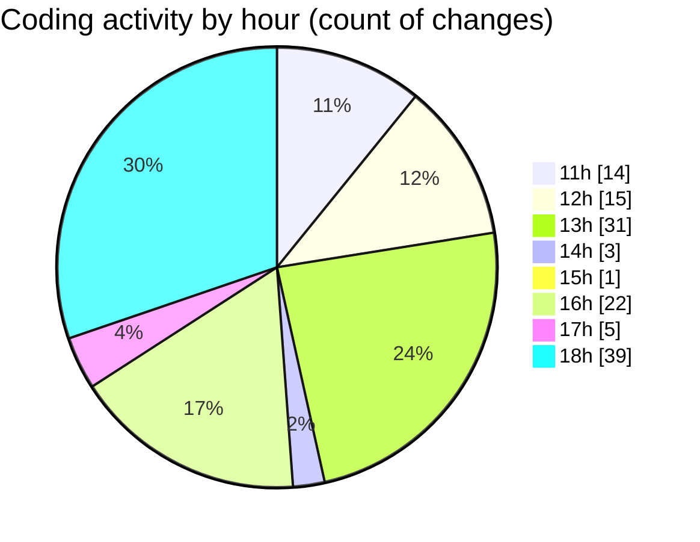

# Argos - Activity Summary 

## Overall Statistics

| Stat                   | Value                                                             |
| ---------------------- | ----------------------------------------------------------------- |
| **Lines Added** (➕)   | 5804                                          |
| **Lines Removed** (➖) | 1764                                        |
| **Net Change** (↕)    | 4040                |
| **Active Time** (⌚)   | 153 minutes |

## Modified Files
- **createFlow.jsx** (+707, -174)
- **Sidenav.jsx** (+609, -0)
- **scheduledMissions.controller.js** (+164, -7)
- **Annotations.jsx** (+1111, -1082)
- **AllRoutes.jsx** (+137, -0)
- **AnnotationSidebar.jsx** (+141, -1)
- **CreateAnnotation.jsx** (+971, -491)
- **Map.jsx** (+1825, -9)
- **HandleAddWaypointOnclick.js** (+139, -0)

## Visualizations

### By File Type (Lines Changed)

### By Hour (Estimated Activity Count)

> **Last Updated:** 09/07/2025, 18:47:51