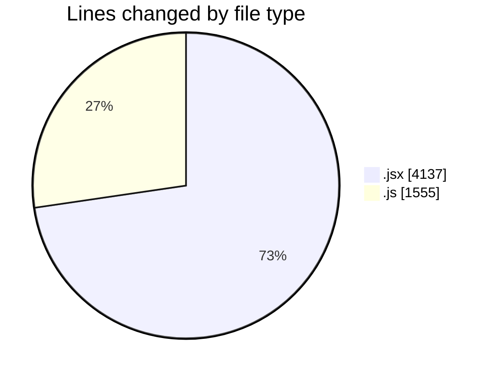
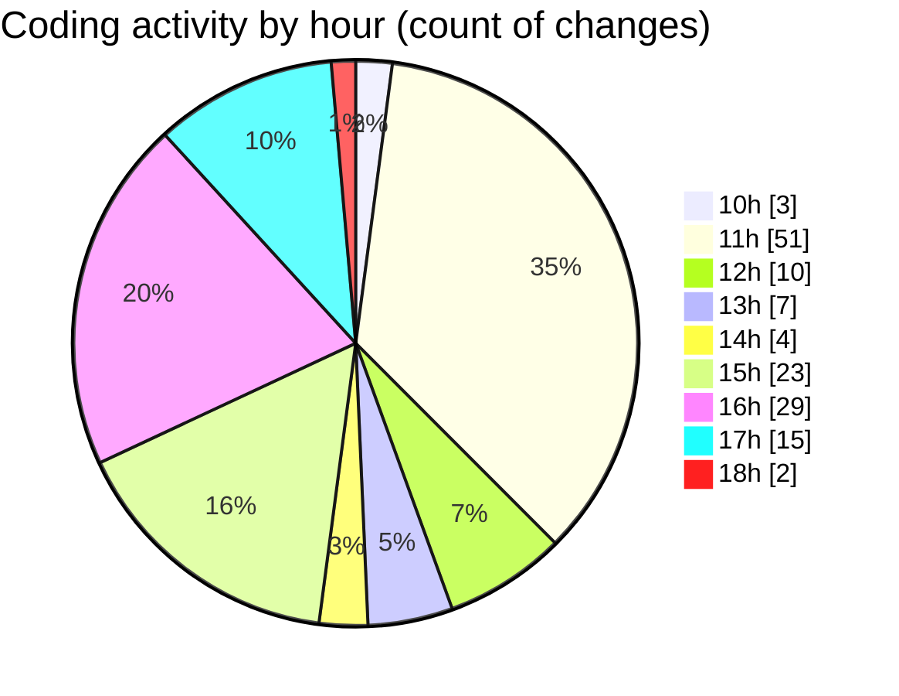

# Argos - Activity Summary 

## Overall Statistics

| Stat                   | Value                                                             |
| ---------------------- | ----------------------------------------------------------------- |
| **Lines Added** (➕)   | 5123                                          |
| **Lines Removed** (➖) | 569                                        |
| **Net Change** (↕)    | 4554                |
| **Active Time** (⌚)   | 162 minutes |

## Modified Files
- **AnnotationSidebar.jsx** (+184, -25)
- **Annotations.jsx** (+69, -1)
- **CreateAnnotation.jsx** (+495, -37)
- **HandleAddWaypointOnclick.js** (+919, -428)
- **Map.jsx** (+1826, -2)
- **LaunchModel.jsx** (+492, -43)
- **dataProcessor.js** (+206, -2)
- **GoToLocation.jsx** (+194, -31)
- **ExistingMission.jsx** (+738, -0)

## Visualizations

### By File Type (Lines Changed)

### By Hour (Estimated Activity Count)

> **Last Updated:** 11/07/2025, 18:06:07