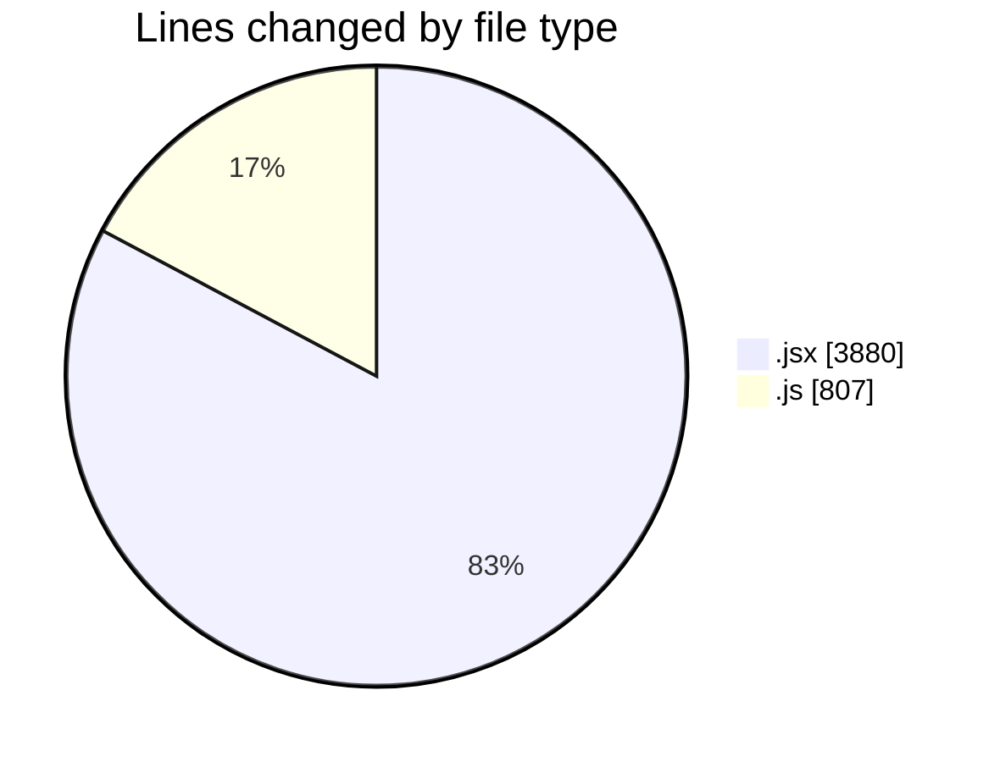
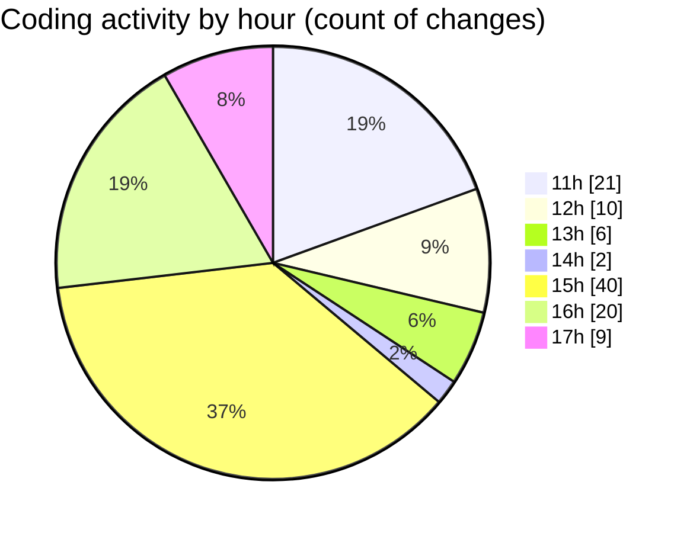

# Argos - Activity Summary 

## Overall Statistics

| Stat                   | Value                                                             |
| ---------------------- | ----------------------------------------------------------------- |
| **Lines Added** (➕)   | 4362                                          |
| **Lines Removed** (➖) | 325                                        |
| **Net Change** (↕)    | 4037                |
| **Active Time** (⌚)   | 120 minutes |

## Modified Files
- **Map.jsx** (+1949, -63)
- **GoToLocation.jsx** (+246, -3)
- **AnnotationSidebar.jsx** (+158, -1)
- **Annotations.jsx** (+74, -0)
- **HandleAddWaypointOnclick.js** (+550, -257)
- **Mission.jsx** (+79, -0)
- **ManageMission.jsx** (+215, -0)
- **LaunchModel.jsx** (+451, -0)
- **LaunchControl.jsx** (+640, -1)

## Visualizations

### By File Type (Lines Changed)

### By Hour (Estimated Activity Count)

> **Last Updated:** 14/07/2025, 17:17:21