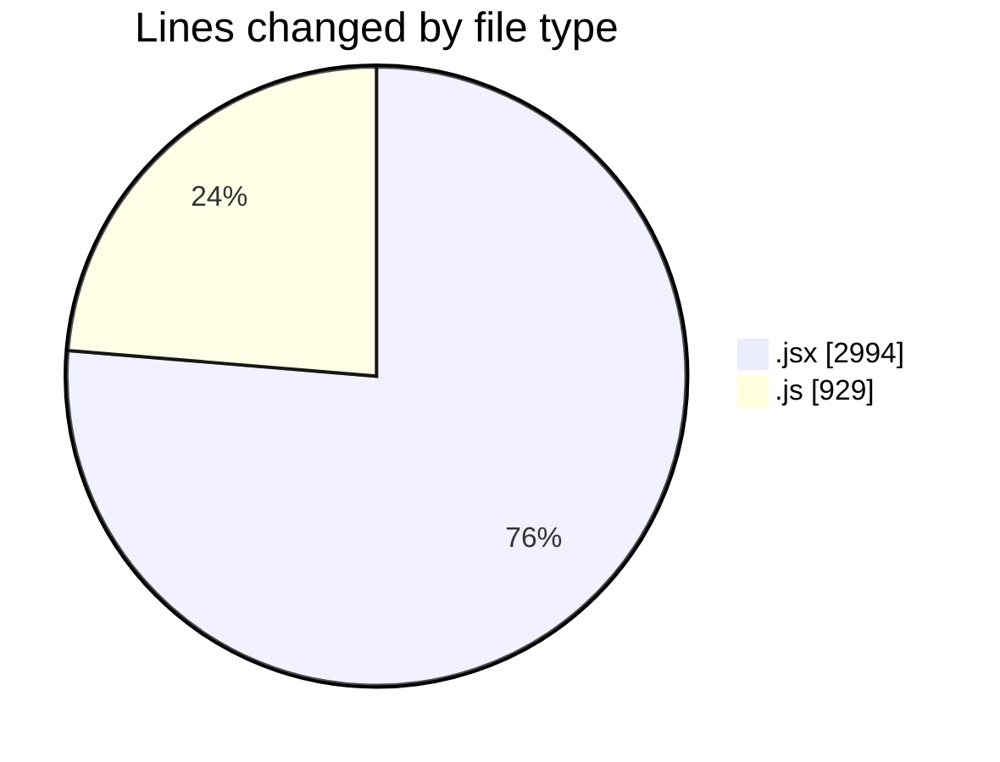

# nxtqube_webapp - Activity Summary 

## Overall Statistics

| Stat                   | Value                                                             |
| ---------------------- | ----------------------------------------------------------------- |
| **Lines Added** (➕)   | 2659                                          |
| **Lines Removed** (➖) | 1264                                        |
| **Net Change** (↕)    | 1395                |
| **Active Time** (⌚)   | 25 minutes |

## Modified Files
- **Map.jsx** (+1695, -1264)
- **constants.js** (+57, -0)
- **useCesiumViewer.js** (+108, -0)
- **SearchBox.jsx** (+35, -0)
- **useMapInteractions.js** (+47, -0)
- **useFenceManagement.js** (+263, -0)
- **useMissionDisplay.js** (+338, -0)
- **useDroneTracking.js** (+79, -0)
- **useLocationServices.js** (+37, -0)

## Visualizations

### By File Type (Lines Changed)

### By Hour (Estimated Activity Count)

> **Last Updated:** 19/07/2025, 17:47:34