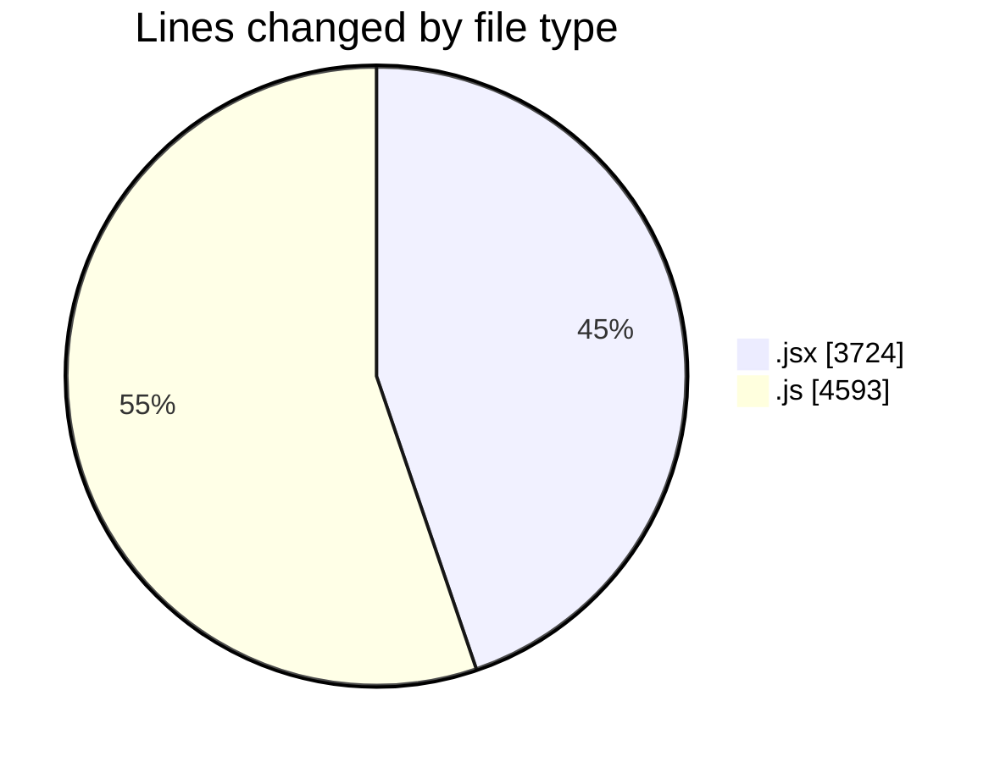
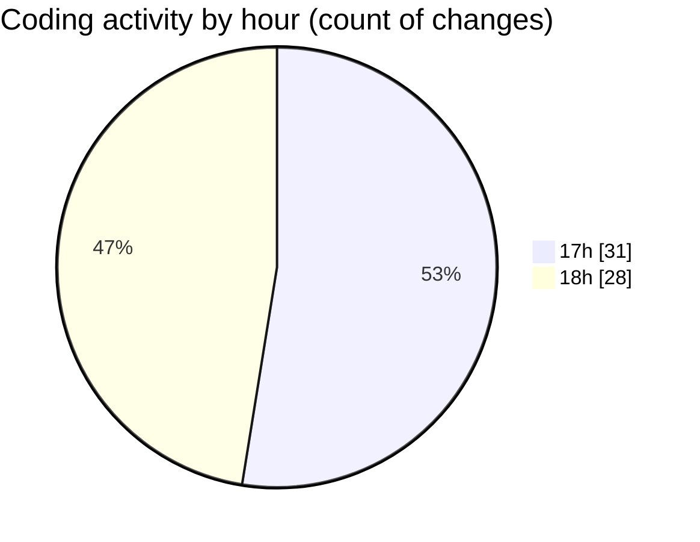

# nxtqube_webapp - Activity Summary 

## Overall Statistics

| Stat                   | Value                                                             |
| ---------------------- | ----------------------------------------------------------------- |
| **Lines Added** (➕)   | 5295                                          |
| **Lines Removed** (➖) | 3022                                        |
| **Net Change** (↕)    | 2273                |
| **Active Time** (⌚)   | 69 minutes |

## Modified Files
- **Map.jsx** (+1995, -1694)
- **constants.js** (+57, -0)
- **useCesiumViewer.js** (+189, -107)
- **SearchBox.jsx** (+35, -0)
- **useMapInteractions.js** (+112, -46)
- **useFenceManagement.js** (+263, -0)
- **useMissionDisplay.js** (+601, -337)
- **useDroneTracking.js** (+79, -0)
- **useLocationServices.js** (+37, -0)
- **drawMission.js** (+578, -112)
- **useMissionDisplay.js** (+846, -485)
- **sharedUtils.js** (+242, -241)
- **sharedUtils.js** (+261, -0)

## Visualizations

### By File Type (Lines Changed)

### By Hour (Estimated Activity Count)

> **Last Updated:** 19/07/2025, 18:55:13