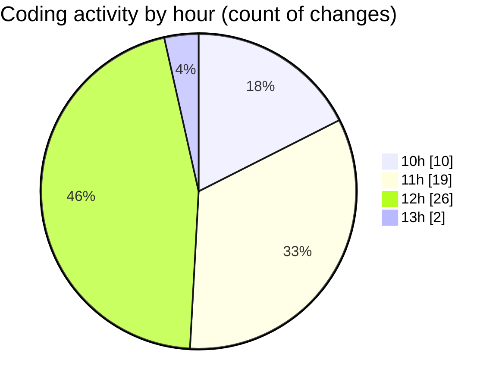

# nxtqube_webapp - Activity Summary 

## Overall Statistics

| Stat                   | Value                                                             |
| ---------------------- | ----------------------------------------------------------------- |
| **Lines Added** (➕)   | 4668                                          |
| **Lines Removed** (➖) | 963                                        |
| **Net Change** (↕)    | 3705                |
| **Active Time** (⌚)   | 73 minutes |

## Modified Files
- **Map.jsx** (+435, -1)
- **Map.jsx** (+1311, -876)
- **useMissionDisplay.js** (+269, -0)
- **useCesiumViewer.js** (+87, -2)
- **DroneControl.jsx** (+1006, -1)
- **LaunchControl.jsx** (+638, -0)
- **useMissionDisplay.js** (+440, -79)
- **ManageMission.jsx** (+220, -4)
- **Existing.jsx** (+262, -0)

## Visualizations

### By File Type (Lines Changed)

### By Hour (Estimated Activity Count)

> **Last Updated:** 21/07/2025, 13:03:09