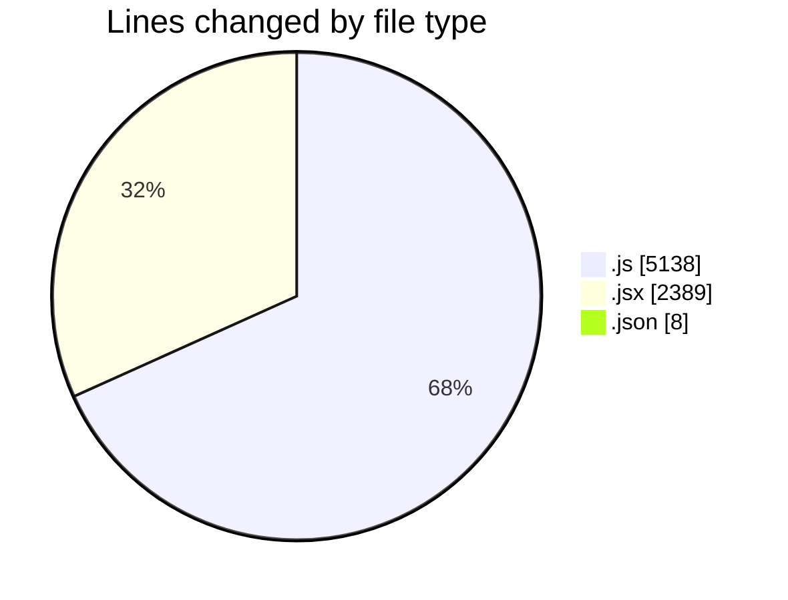
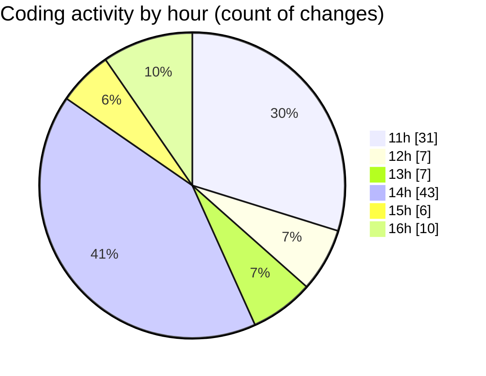

# nxtqube_webapp - Activity Summary 

## Overall Statistics

| Stat                   | Value                                                             |
| ---------------------- | ----------------------------------------------------------------- |
| **Lines Added** (➕)   | 6625                                          |
| **Lines Removed** (➖) | 910                                        |
| **Net Change** (↕)    | 5715                |
| **Active Time** (⌚)   | 144 minutes |

## Modified Files
- **useMissionDisplay.js** (+735, -184)
- **Map.jsx** (+919, -465)
- **InMission copy.js** (+1, -0)
- **addLocation.js** (+1, -0)
- **calculateDistance2D.js** (+1, -0)
- **getUser.js** (+1, -0)
- **waypointUtils.js** (+74, -0)
- **missionUtils.js** (+46, -0)
- **recenterUtils.js** (+33, -0)
- **geofenceUtils.js** (+38, -0)
- **droneUtils.js** (+27, -0)
- **apiUtils.js** (+24, -0)
- **useMapInteractions.js** (+49, -2)
- **drawMission.js** (+35, -27)
- **useDroneTracking.js** (+80, -1)
- **useFenceManagement.js** (+263, -4)
- **commandApi.js** (+14, -12)
- **HandleAddWaypointOnclick.js** (+293, -0)
- **drawMission.js** (+474, -8)
- **droneLocation.js** (+150, -20)
- **circularFence.js** (+317, -106)
- **polygonFence.js** (+188, -11)
- **showFences.js** (+85, -0)
- **deleteLastWaypoint.js** (+83, -70)
- **settings.json** (+8, -0)
- **drawMission.js** (+466, -0)
- **HandleAddWaypointOnclick.js** (+293, -0)
- **useFenceManagement.js** (+263, -0)
- **useMissionDisplay.js** (+551, -0)
- **useCesiumViewer.js** (+108, -0)
- **DroneControl.jsx** (+1005, -0)

## Visualizations

### By File Type (Lines Changed)

### By Hour (Estimated Activity Count)

> **Last Updated:** 23/07/2025, 16:23:36