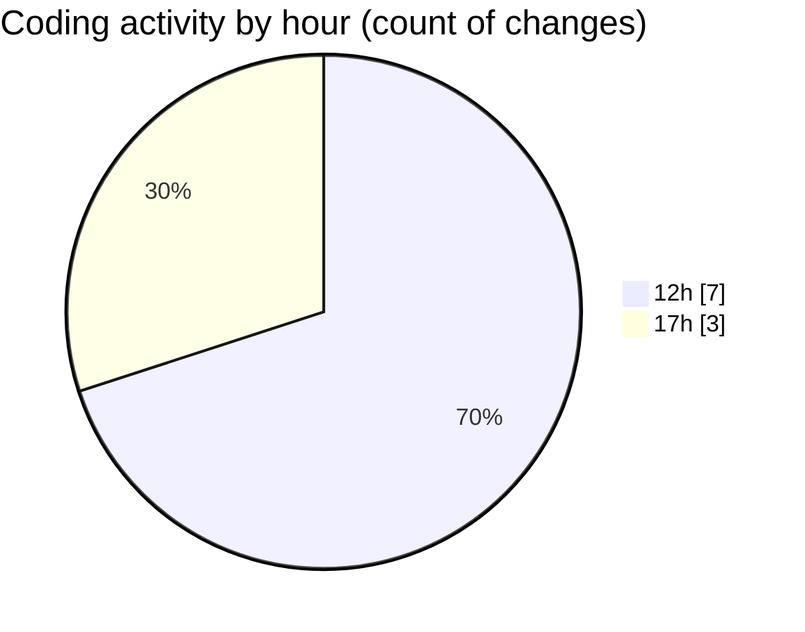

# nxtqube_webapp - Activity Summary 

## Overall Statistics

| Stat                   | Value                                                             |
| ---------------------- | ----------------------------------------------------------------- |
| **Lines Added** (➕)   | 2671                                          |
| **Lines Removed** (➖) | 13                                        |
| **Net Change** (↕)    | 2658                |
| **Active Time** (⌚)   | 11 minutes |

## Modified Files
- **Map.jsx** (+1888, -0)
- **ManualControls.jsx** (+280, -0)
- **MissionEmergencyButtons.jsx** (+211, -0)
- **EmergencySwitches.jsx** (+205, -0)
- **DeleteMission.jsx** (+67, -0)
- **removeEntities.js** (+20, -13)

## Visualizations

### By File Type (Lines Changed)

### By Hour (Estimated Activity Count)

> **Last Updated:** 24/07/2025, 17:08:59