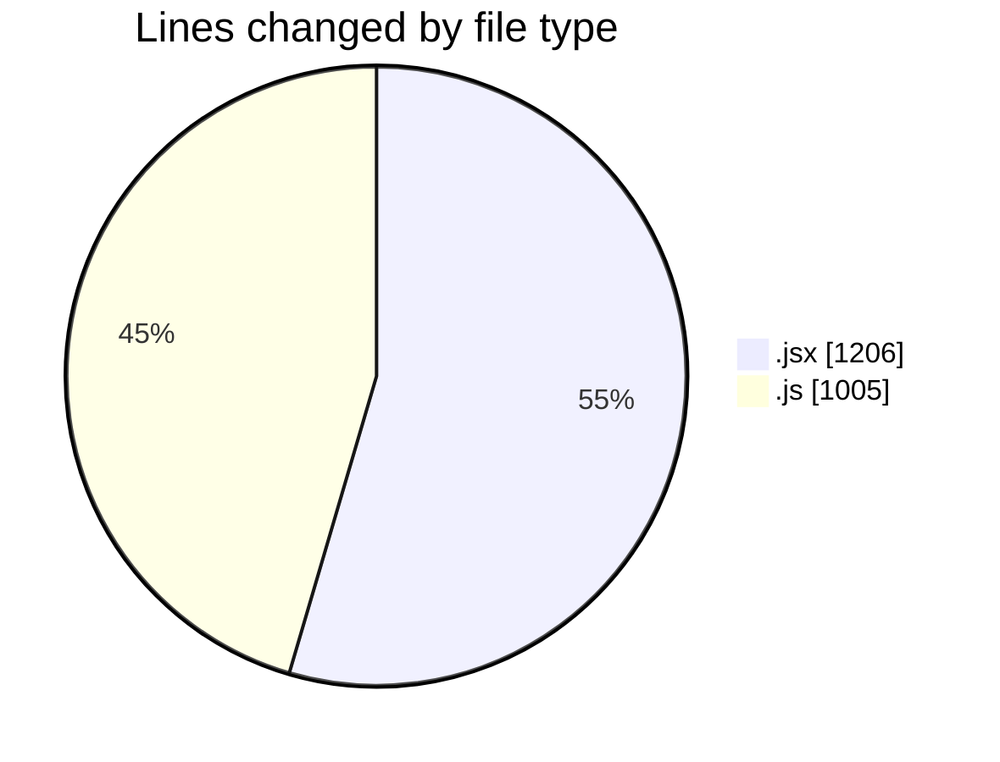
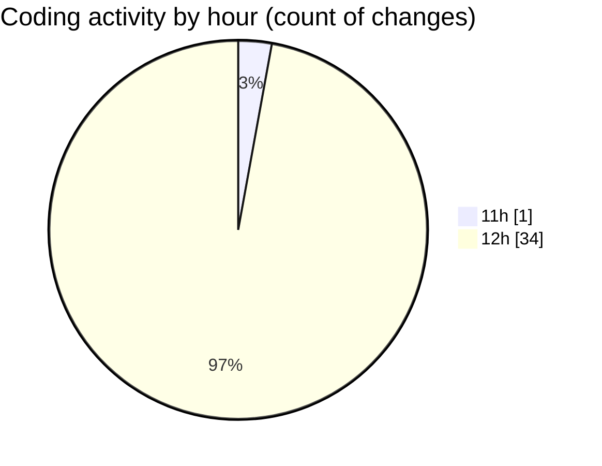

# nxtqube_webapp - Activity Summary 

## Overall Statistics

| Stat                   | Value                                                             |
| ---------------------- | ----------------------------------------------------------------- |
| **Lines Added** (➕)   | 2202                                          |
| **Lines Removed** (➖) | 9                                        |
| **Net Change** (↕)    | 2193                |
| **Active Time** (⌚)   | 41 minutes |

## Modified Files
- **Map.jsx** (+489, -0)
- **useMissionDisplay.js** (+551, -0)
- **ManageMission.jsx** (+201, -1)
- **HandleAddWaypointOnclick.js** (+293, -2)
- **locationService.js** (+108, -4)
- **removeEntities.js** (+47, -0)
- **DeleteMission.jsx** (+87, -0)
- **Mission.jsx** (+69, -2)
- **Create.jsx** (+357, -0)

## Visualizations

### By File Type (Lines Changed)

### By Hour (Estimated Activity Count)

> **Last Updated:** 25/07/2025, 13:00:26