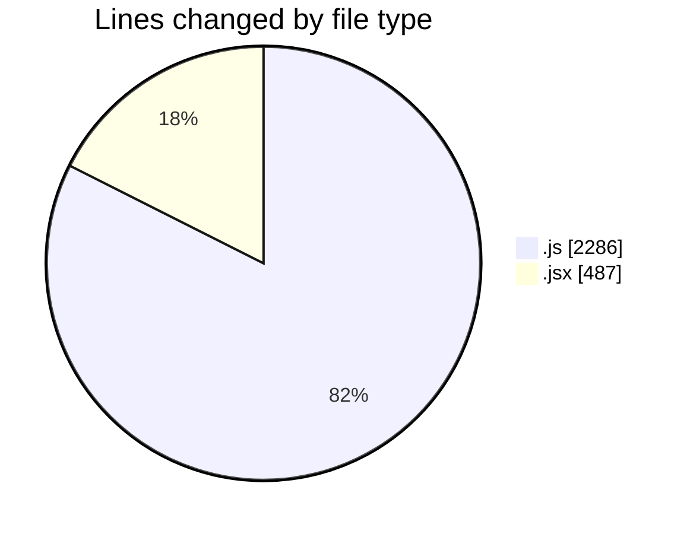
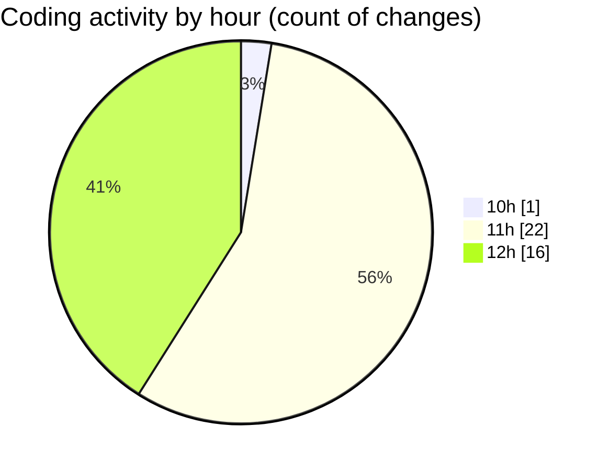

# nxtqube_webapp - Activity Summary 

## Overall Statistics

| Stat                   | Value                                                             |
| ---------------------- | ----------------------------------------------------------------- |
| **Lines Added** (➕)   | 2316                                          |
| **Lines Removed** (➖) | 457                                        |
| **Net Change** (↕)    | 1859                |
| **Active Time** (⌚)   | 53 minutes |

## Modified Files
- **HandleAddWaypointOnclick.js** (+314, -27)
- **Map.jsx** (+484, -3)
- **useMapInteractions.js** (+47, -0)
- **drawMission.js** (+919, -427)
- **useMissionDisplay.js** (+552, -0)

## Visualizations

### By File Type (Lines Changed)

### By Hour (Estimated Activity Count)

> **Last Updated:** 27/07/2025, 12:17:52