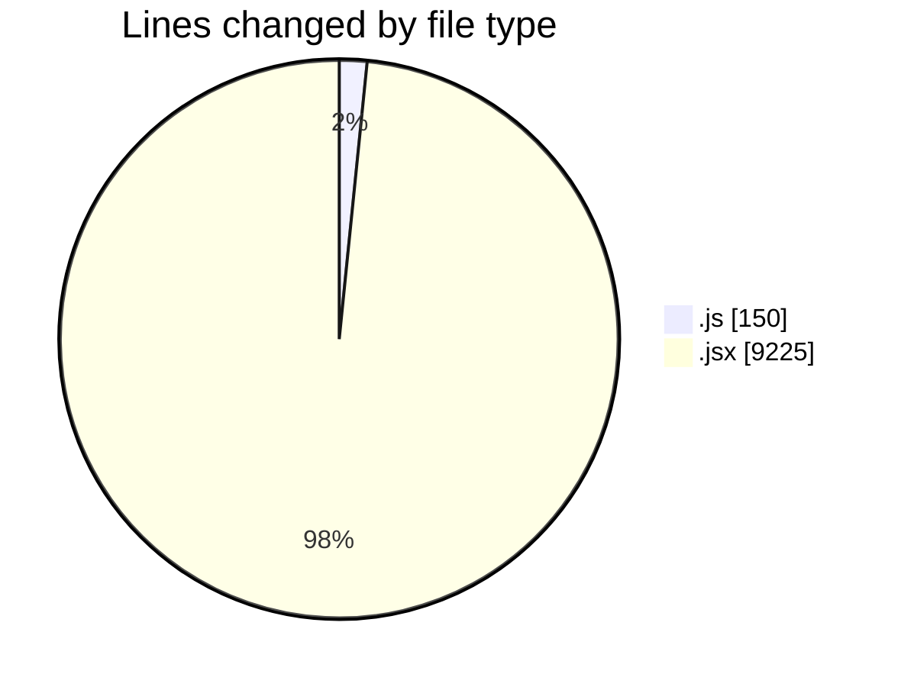
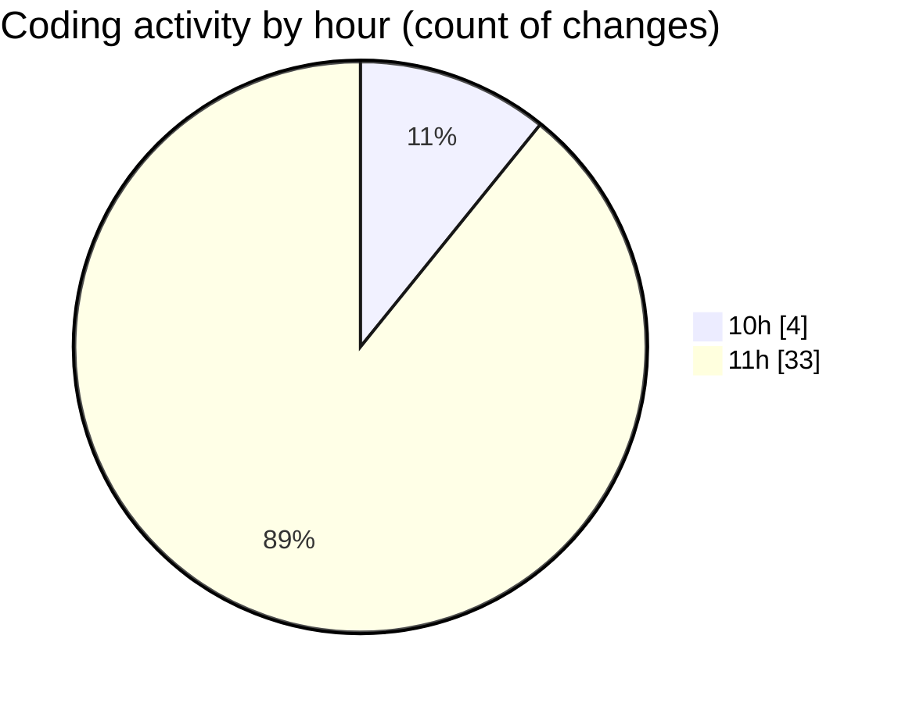

# nxtqube_webapp - Activity Summary 

## Overall Statistics

| Stat                   | Value                                                             |
| ---------------------- | ----------------------------------------------------------------- |
| **Lines Added** (➕)   | 8671                                          |
| **Lines Removed** (➖) | 704                                        |
| **Net Change** (↕)    | 7967                |
| **Active Time** (⌚)   | 43 minutes |

## Modified Files
- **useCesiumViewer.js** (+147, -3)
- **Map.jsx** (+498, -1)
- **Create.jsx** (+394, -63)
- **createMissionHome.jsx** (+331, -0)
- **createMissionHome.jsx** (+331, -0)
- **createPathMission.jsx** (+63, -0)
- **ManageMission.jsx** (+200, -0)
- **ManageMission copy.jsx** (+202, -0)
- **LaunchControl.jsx** (+1275, -637)
- **ExistingMission.jsx** (+739, -0)
- **LaunchModel.jsx** (+451, -0)
- **EmergencySwitches.jsx** (+205, -0)
- **SelectedDronePreview.jsx** (+207, -0)
- **MissionEmergencyButtons.jsx** (+211, -0)
- **MissionLogs.jsx** (+409, -0)
- **flows.jsx** (+369, -0)
- **App.jsx** (+323, -0)
- **sequenceMessageHandler.jsx** (+18, -0)
- **notificationHandler.jsx** (+243, -0)
- **droneCommandHandler.jsx** (+320, -0)
- **ExistingFenceForm.jsx** (+578, -0)
- **MissionControl.jsx** (+903, -0)
- **WaypointAction.jsx** (+254, -0)

## Visualizations

### By File Type (Lines Changed)

### By Hour (Estimated Activity Count)

> **Last Updated:** 28/07/2025, 11:43:11