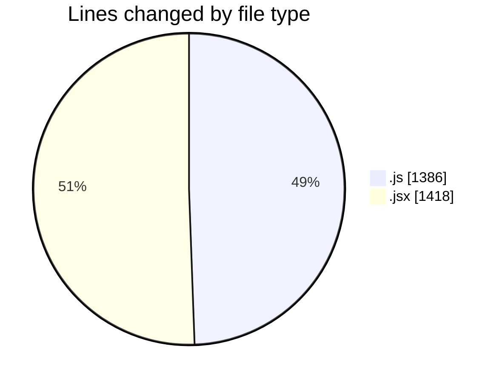
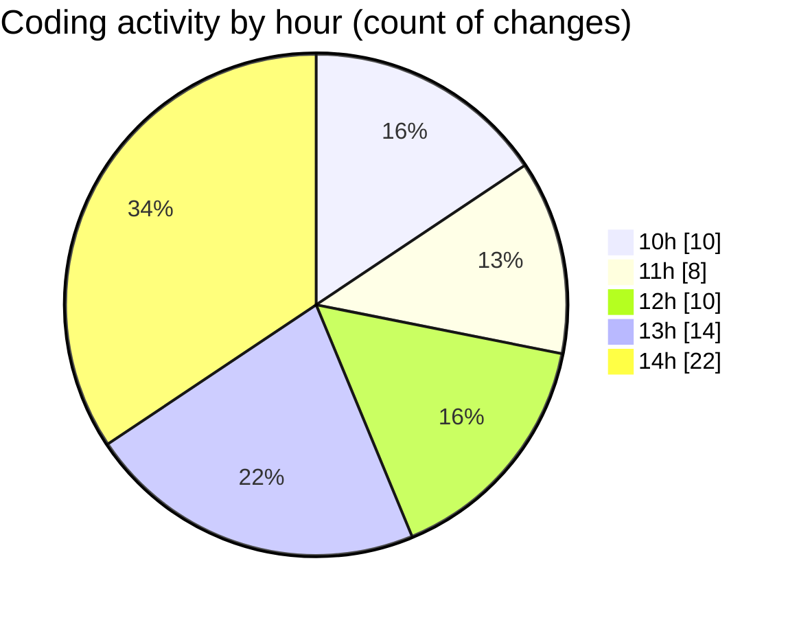

# nxtqube_webapp - Activity Summary 

## Overall Statistics

| Stat                   | Value                                                             |
| ---------------------- | ----------------------------------------------------------------- |
| **Lines Added** (➕)   | 2704                                          |
| **Lines Removed** (➖) | 100                                        |
| **Net Change** (↕)    | 2604                |
| **Active Time** (⌚)   | 106 minutes |

## Modified Files
- **constants.js** (+65, -0)
- **useMissionDisplay.js** (+677, -70)
- **waypointUtils.js** (+129, -0)
- **App.jsx** (+323, -0)
- **MissionInfo.jsx** (+481, -19)
- **missionUtils.js** (+439, -6)
- **MissionControl.jsx** (+516, -5)
- **MissionSlider.jsx** (+74, -0)

## Visualizations

### By File Type (Lines Changed)

### By Hour (Estimated Activity Count)

> **Last Updated:** 29/07/2025, 14:41:43