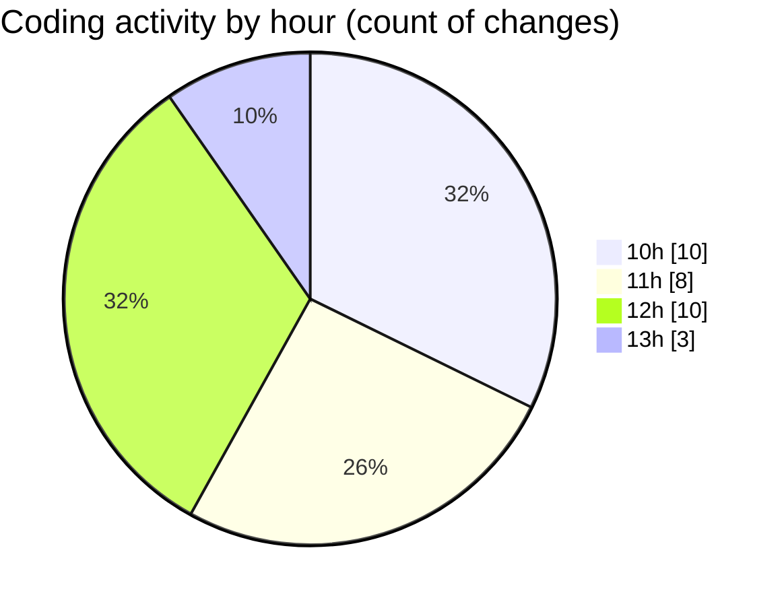

# nxtqube_webapp - Activity Summary 

## Overall Statistics

| Stat                   | Value                                                             |
| ---------------------- | ----------------------------------------------------------------- |
| **Lines Added** (➕)   | 2580                                          |
| **Lines Removed** (➖) | 87                                        |
| **Net Change** (↕)    | 2493                |
| **Active Time** (⌚)   | 53 minutes |

## Modified Files
- **constants.js** (+65, -0)
- **useMissionDisplay.js** (+677, -70)
- **waypointUtils.js** (+129, -0)
- **App.jsx** (+323, -0)
- **MissionInfo.jsx** (+442, -17)
- **missionUtils.js** (+434, -0)
- **MissionControl.jsx** (+510, -0)

## Visualizations

### By File Type (Lines Changed)

### By Hour (Estimated Activity Count)

> **Last Updated:** 29/07/2025, 13:06:21