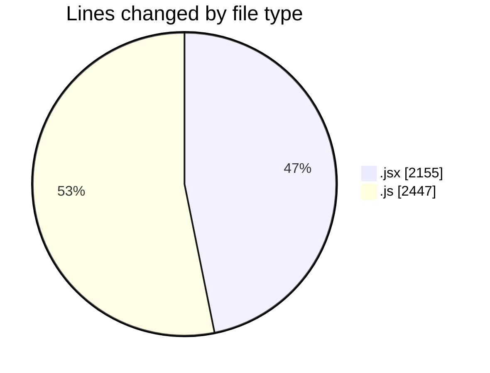
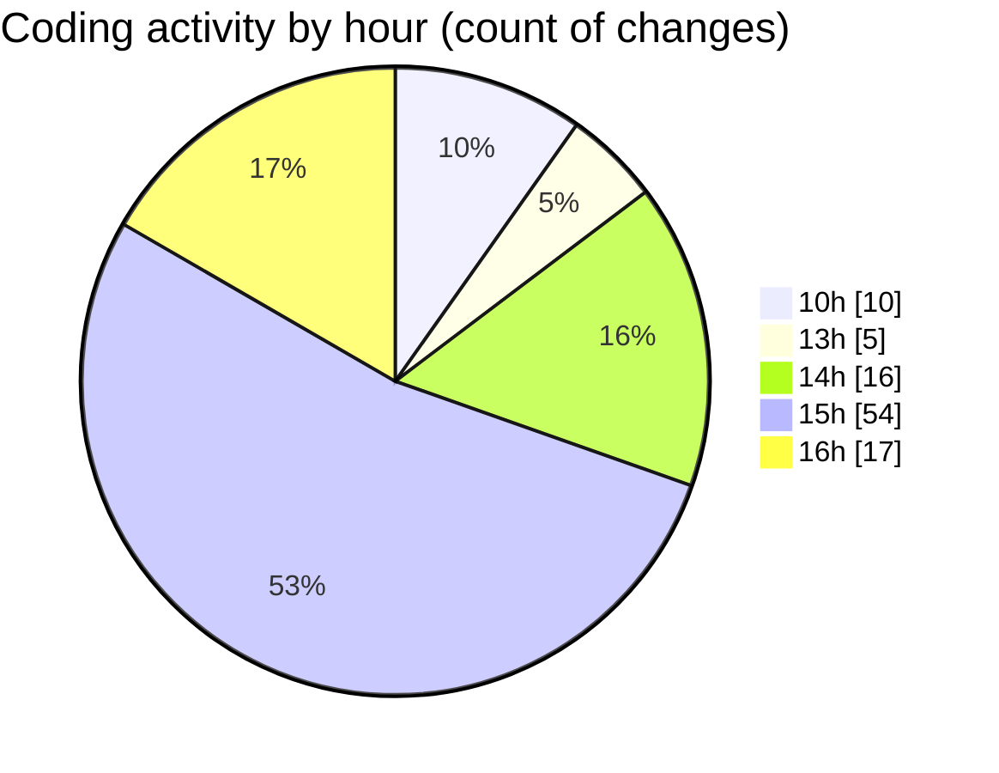

# nxtqube_webapp - Activity Summary 

## Overall Statistics

| Stat                   | Value                                                             |
| ---------------------- | ----------------------------------------------------------------- |
| **Lines Added** (➕)   | 3470                                          |
| **Lines Removed** (➖) | 1132                                        |
| **Net Change** (↕)    | 2338                |
| **Active Time** (⌚)   | 130 minutes |

## Modified Files
- **SearchBox.jsx** (+622, -415)
- **Map.jsx** (+510, -11)
- **useCesiumViewer.js** (+203, -50)
- **deleteLastWaypoint.js** (+81, -5)
- **MissionControl.jsx** (+589, -8)
- **HandleAddWaypointOnclick.js** (+279, -9)
- **drawMission.js** (+944, -560)
- **waypointUtils.js** (+242, -74)

## Visualizations

### By File Type (Lines Changed)

### By Hour (Estimated Activity Count)

> **Last Updated:** 30/07/2025, 16:41:16