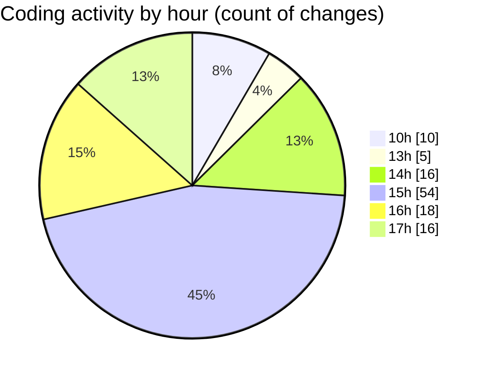

# nxtqube_webapp - Activity Summary 

## Overall Statistics

| Stat                   | Value                                                             |
| ---------------------- | ----------------------------------------------------------------- |
| **Lines Added** (➕)   | 3627                                          |
| **Lines Removed** (➖) | 1132                                        |
| **Net Change** (↕)    | 2495                |
| **Active Time** (⌚)   | 153 minutes |

## Modified Files
- **SearchBox.jsx** (+622, -415)
- **Map.jsx** (+510, -11)
- **useCesiumViewer.js** (+203, -50)
- **deleteLastWaypoint.js** (+88, -5)
- **MissionControl.jsx** (+592, -8)
- **HandleAddWaypointOnclick.js** (+283, -9)
- **drawMission.js** (+1009, -560)
- **waypointUtils.js** (+242, -74)
- **removeEntities.js** (+45, -0)
- **addMidpointWaypoint.js** (+33, -0)

## Visualizations

### By File Type (Lines Changed)

### By Hour (Estimated Activity Count)

> **Last Updated:** 30/07/2025, 17:26:16