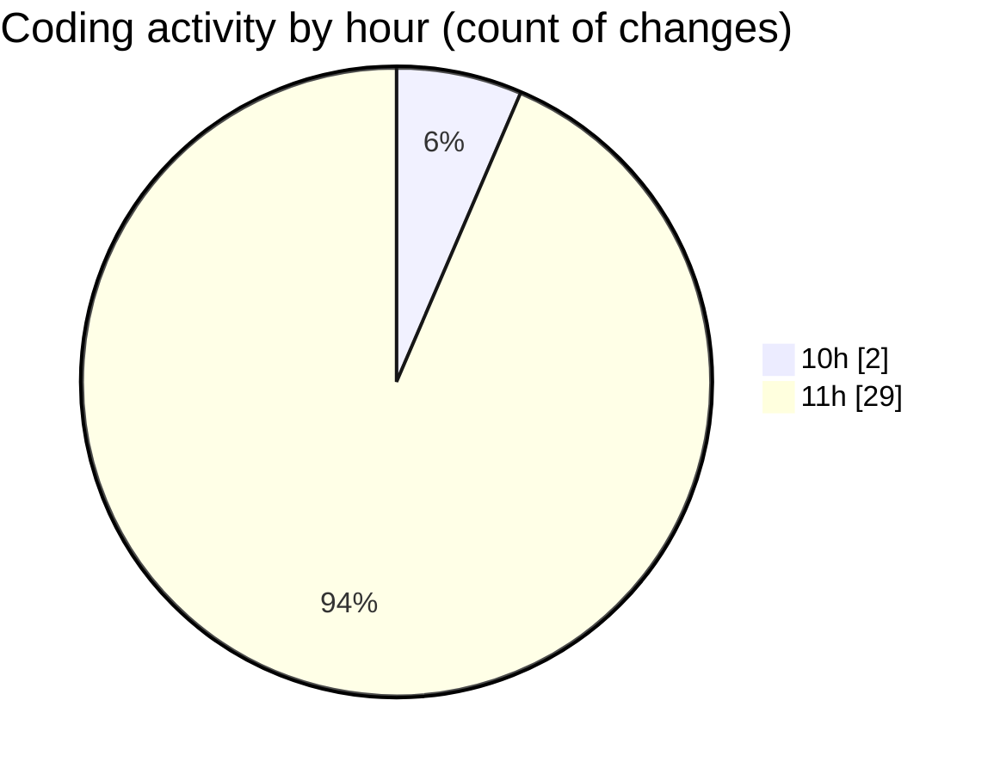

# nxtqube_webapp - Activity Summary 

## Overall Statistics

| Stat                   | Value                                                             |
| ---------------------- | ----------------------------------------------------------------- |
| **Lines Added** (➕)   | 2009                                          |
| **Lines Removed** (➖) | 26                                        |
| **Net Change** (↕)    | 1983                |
| **Active Time** (⌚)   | 39 minutes |

## Modified Files
- **Annotations.jsx** (+74, -0)
- **settings.json** (+9, -0)
- **MissionControl.jsx** (+582, -1)
- **missionTimeDataSlice.js** (+23, -0)
- **HandleAddWaypointOnclick.js** (+273, -1)
- **calculateTime.js** (+187, -16)
- **TotalTime.jsx** (+250, -8)
- **fetchHomeLocation.jsx** (+32, -0)
- **useMapInteractions.js** (+48, -0)
- **Map.jsx** (+531, -0)

## Visualizations

### By File Type (Lines Changed)

### By Hour (Estimated Activity Count)

> **Last Updated:** 31/07/2025, 11:55:26