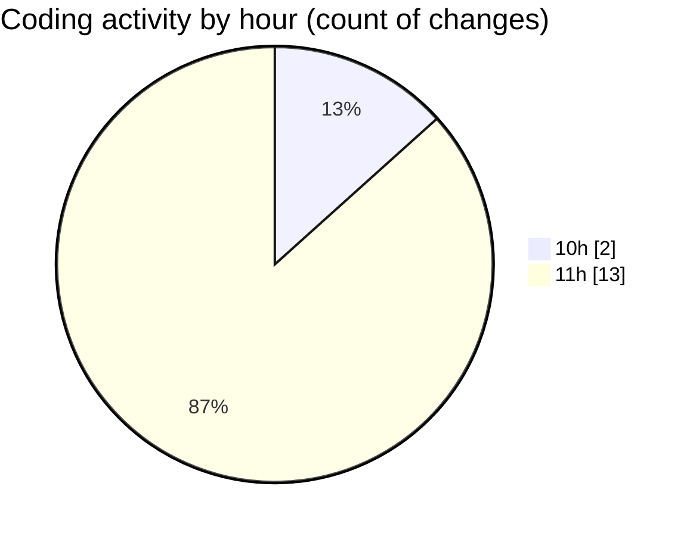

# nxtqube_webapp - Activity Summary 

## Overall Statistics

| Stat                   | Value                                                             |
| ---------------------- | ----------------------------------------------------------------- |
| **Lines Added** (➕)   | 1138                                          |
| **Lines Removed** (➖) | 3                                        |
| **Net Change** (↕)    | 1135                |
| **Active Time** (⌚)   | 11 minutes |

## Modified Files
- **Annotations.jsx** (+74, -0)
- **settings.json** (+9, -0)
- **MissionControl.jsx** (+582, -1)
- **missionTimeDataSlice.js** (+23, -0)
- **HandleAddWaypointOnclick.js** (+272, -0)
- **calculateTime.js** (+178, -2)

## Visualizations

### By File Type (Lines Changed)

### By Hour (Estimated Activity Count)

> **Last Updated:** 31/07/2025, 11:35:26