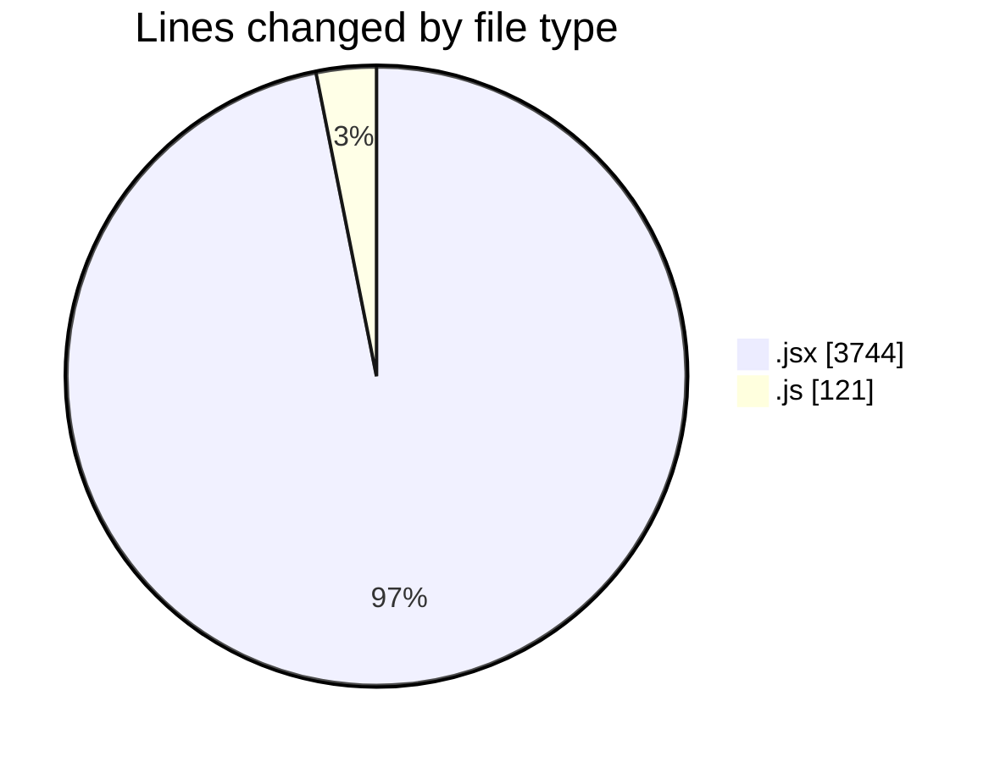
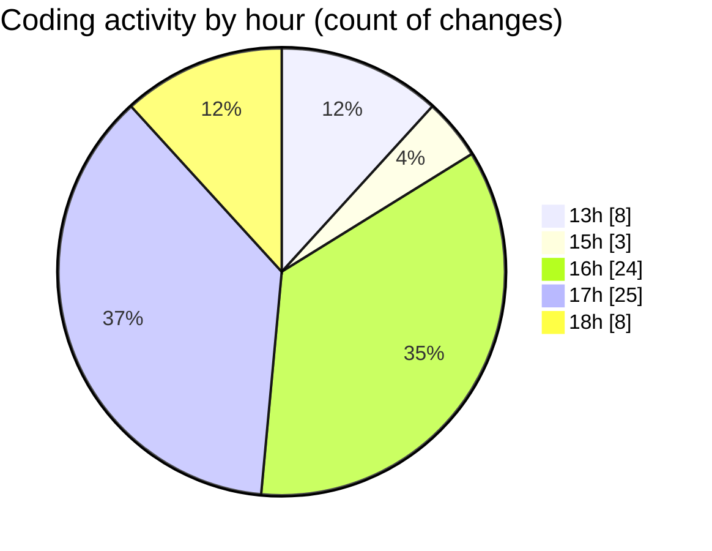

# nxtqube_webapp - Activity Summary 

## Overall Statistics

| Stat                   | Value                                                             |
| ---------------------- | ----------------------------------------------------------------- |
| **Lines Added** (➕)   | 3471                                          |
| **Lines Removed** (➖) | 394                                        |
| **Net Change** (↕)    | 3077                |
| **Active Time** (⌚)   | 97 minutes |

## Modified Files
- **createPathMission.jsx** (+105, -0)
- **DeleteMission.jsx** (+38, -0)
- **Existing.jsx** (+275, -0)
- **ExistingMission.jsx** (+654, -35)
- **MissionInfo.jsx** (+507, -2)
- **ManageMission.jsx** (+580, -318)
- **createMissionHome.jsx** (+498, -0)
- **TabContext.jsx** (+143, -39)
- **tabStateUtils.js** (+96, -0)
- **tabConstants.js** (+25, -0)
- **Map.jsx** (+550, -0)

## Visualizations

### By File Type (Lines Changed)

### By Hour (Estimated Activity Count)

> **Last Updated:** 01/08/2025, 18:08:53