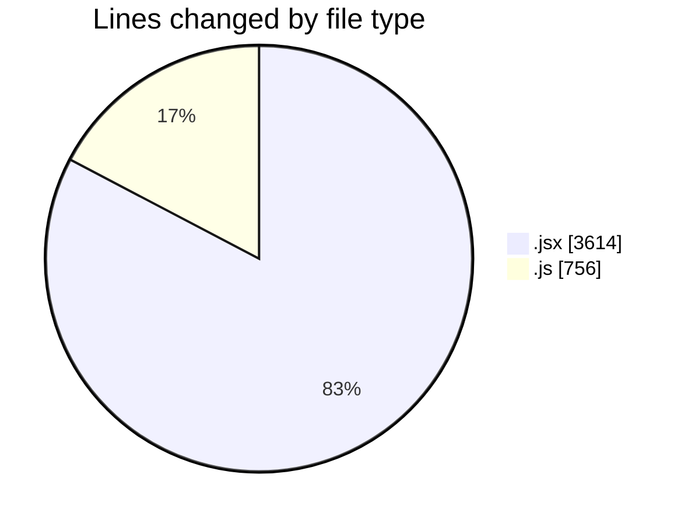
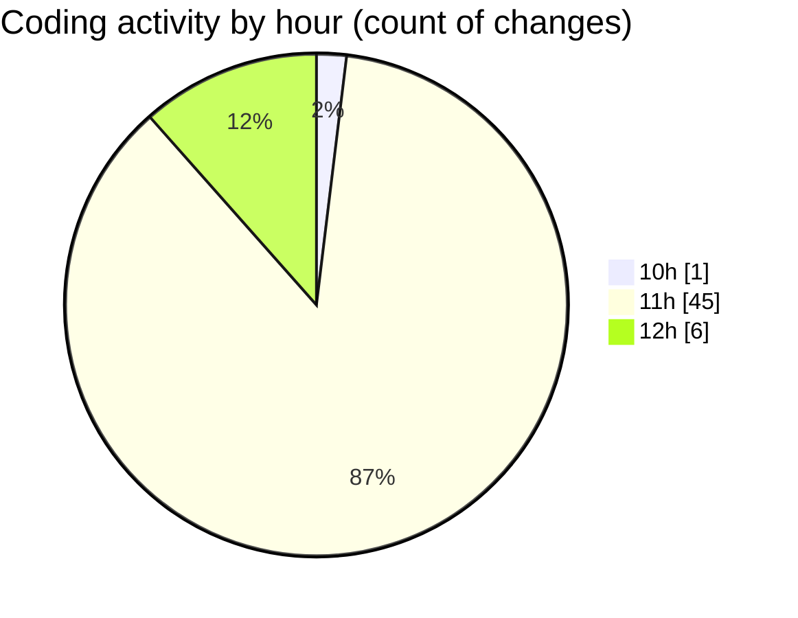

# nxtqube_webapp - Activity Summary 

## Overall Statistics

| Stat                   | Value                                                             |
| ---------------------- | ----------------------------------------------------------------- |
| **Lines Added** (➕)   | 4084                                          |
| **Lines Removed** (➖) | 286                                        |
| **Net Change** (↕)    | 3798                |
| **Active Time** (⌚)   | 65 minutes |

## Modified Files
- **ManageMission.jsx** (+455, -197)
- **createMissionHome.jsx** (+545, -47)
- **ExistingMission.jsx** (+654, -4)
- **SelectMissionSlice.js** (+21, -0)
- **createPathMission.jsx** (+143, -38)
- **Map.jsx** (+558, -0)
- **tabStateUtils.js** (+111, -0)
- **Map.jsx** (+454, -0)
- **MissionInfo.jsx** (+519, -0)
- **useMissionDisplay.js** (+624, -0)

## Visualizations

### By File Type (Lines Changed)

### By Hour (Estimated Activity Count)

> **Last Updated:** 03/08/2025, 12:38:03