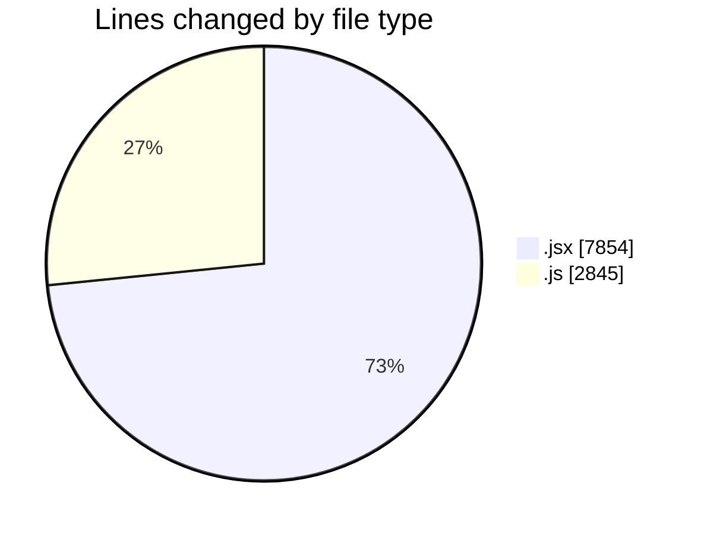
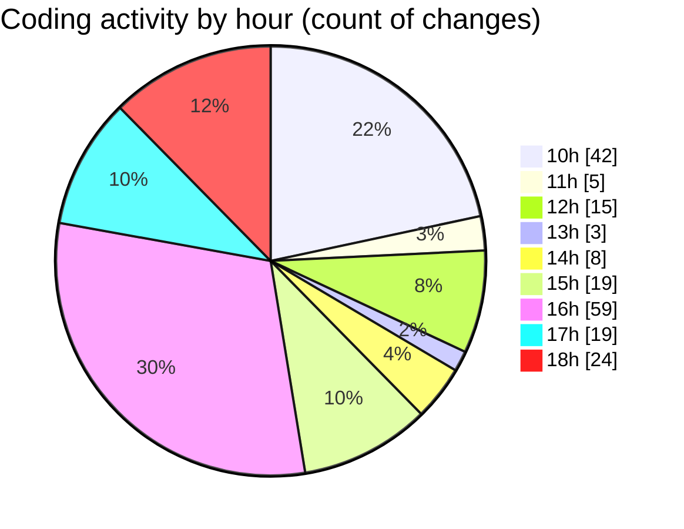

# nxtqube_webapp - Activity Summary 

## Overall Statistics

| Stat                   | Value                                                             |
| ---------------------- | ----------------------------------------------------------------- |
| **Lines Added** (➕)   | 8783                                          |
| **Lines Removed** (➖) | 1916                                        |
| **Net Change** (↕)    | 6867                |
| **Active Time** (⌚)   | 232 minutes |

## Modified Files
- **ExistingMission.jsx** (+722, -92)
- **SelectMissionSlice.js** (+31, -0)
- **Map.jsx** (+640, -82)
- **useMissionDisplay.js** (+833, -163)
- **Mission.jsx** (+115, -6)
- **ManageMission.jsx** (+273, -4)
- **HandleAddWaypointOnclick.js** (+405, -55)
- **useMapInteractions.js** (+66, -0)
- **drawMission.js** (+449, -69)
- **Existing.jsx** (+281, -3)
- **ExistingMission.jsx** (+755, -365)
- **ManageMission.jsx** (+328, -50)
- **LaunchControl.jsx** (+673, -68)
- **MissionUpload.jsx** (+108, -35)
- **CommonModals.jsx** (+301, -300)
- **SearchComponents.jsx** (+122, -121)
- **MissionCardComponents.jsx** (+254, -253)
- **ButtonComponents.jsx** (+229, -228)
- **missionUtils.js** (+271, -0)
- **apiUtils.js** (+191, -0)
- **hookUtils.js** (+238, -0)
- **index.js** (+4, -0)
- **DockVideo.jsx** (+894, -6)
- **MissionInfo.jsx** (+534, -12)
- **video.controller.js** (+66, -4)

## Visualizations

### By File Type (Lines Changed)

### By Hour (Estimated Activity Count)

> **Last Updated:** 04/08/2025, 18:42:59