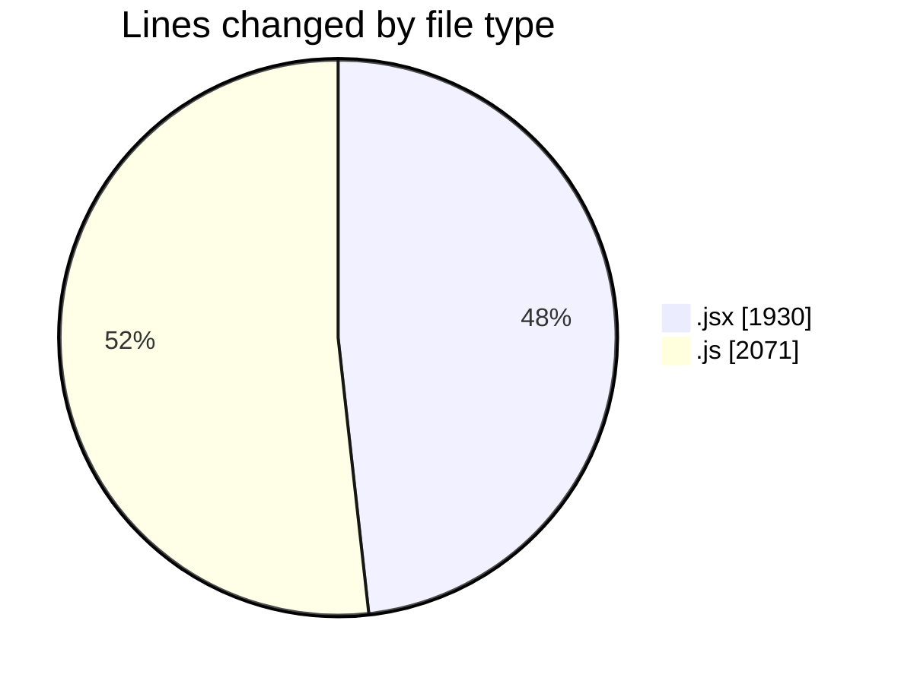
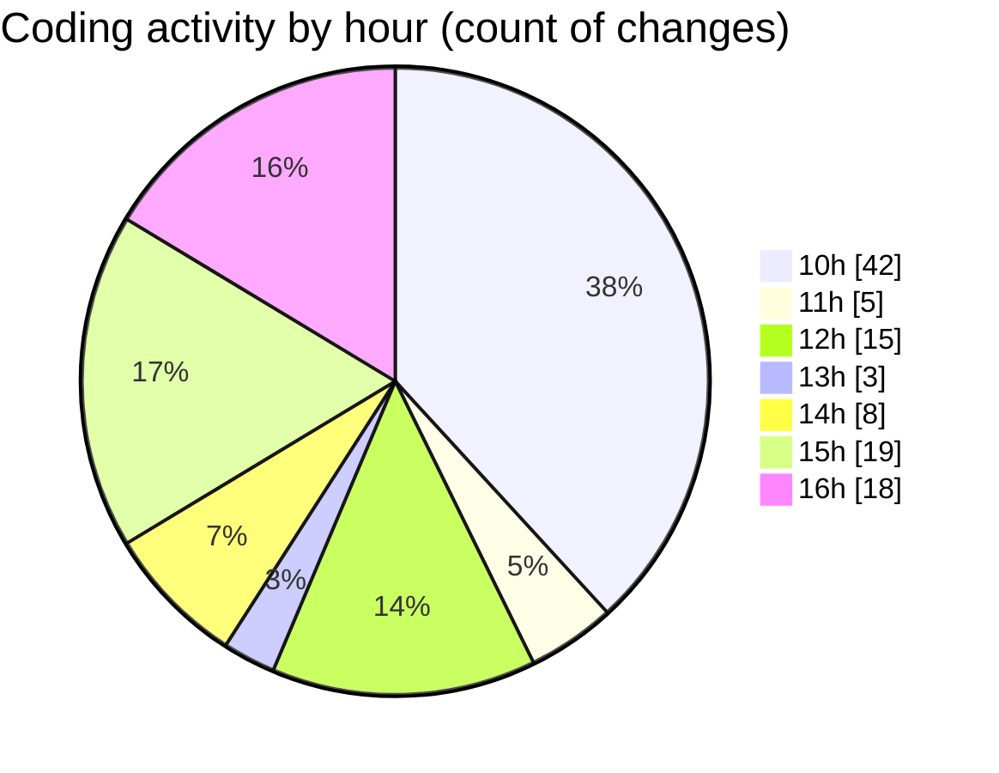

# nxtqube_webapp - Activity Summary 

## Overall Statistics

| Stat                   | Value                                                             |
| ---------------------- | ----------------------------------------------------------------- |
| **Lines Added** (➕)   | 3530                                          |
| **Lines Removed** (➖) | 471                                        |
| **Net Change** (↕)    | 3059                |
| **Active Time** (⌚)   | 139 minutes |

## Modified Files
- **ExistingMission.jsx** (+722, -92)
- **SelectMissionSlice.js** (+31, -0)
- **Map.jsx** (+636, -82)
- **useMissionDisplay.js** (+833, -163)
- **Mission.jsx** (+115, -6)
- **ManageMission.jsx** (+273, -4)
- **HandleAddWaypointOnclick.js** (+405, -55)
- **useMapInteractions.js** (+66, -0)
- **drawMission.js** (+449, -69)

## Visualizations

### By File Type (Lines Changed)

### By Hour (Estimated Activity Count)

> **Last Updated:** 04/08/2025, 16:18:33