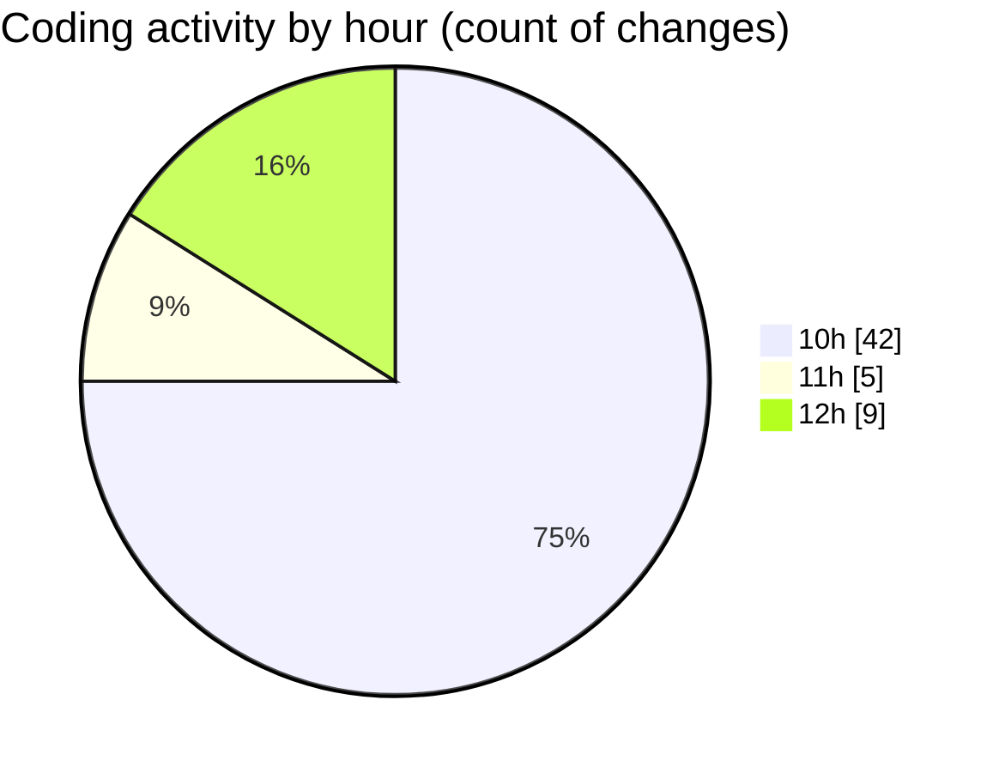

# nxtqube_webapp - Activity Summary 

## Overall Statistics

| Stat                   | Value                                                             |
| ---------------------- | ----------------------------------------------------------------- |
| **Lines Added** (➕)   | 2512                                          |
| **Lines Removed** (➖) | 270                                        |
| **Net Change** (↕)    | 2242                |
| **Active Time** (⌚)   | 70 minutes |

## Modified Files
- **ExistingMission.jsx** (+716, -90)
- **SelectMissionSlice.js** (+31, -0)
- **Map.jsx** (+564, -9)
- **useMissionDisplay.js** (+833, -161)
- **Mission.jsx** (+101, -6)
- **ManageMission.jsx** (+267, -4)

## Visualizations

### By File Type (Lines Changed)

### By Hour (Estimated Activity Count)

> **Last Updated:** 04/08/2025, 12:22:10