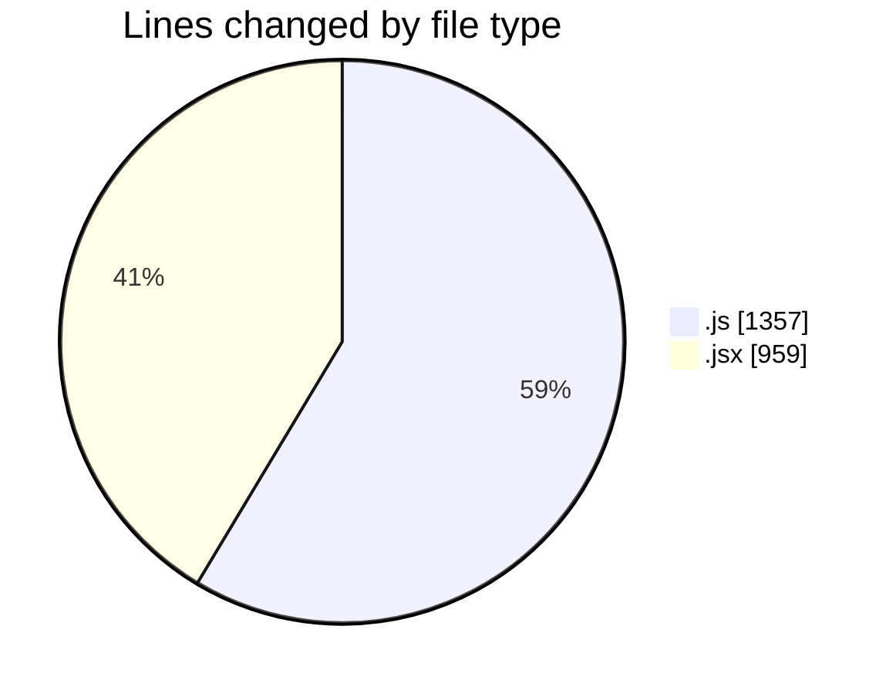
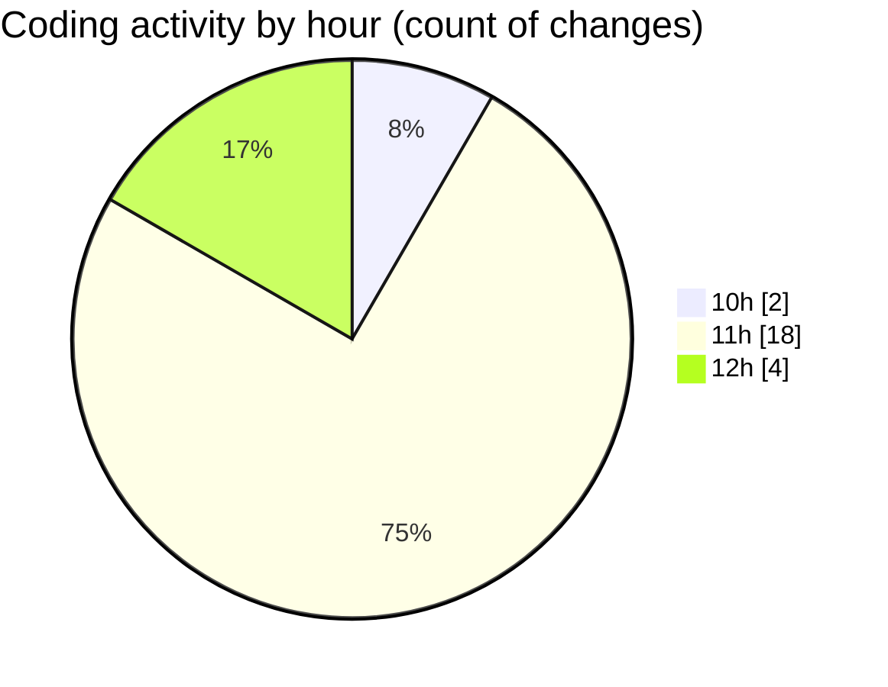

# nxtqube_webapp - Activity Summary 

## Overall Statistics

| Stat                   | Value                                                             |
| ---------------------- | ----------------------------------------------------------------- |
| **Lines Added** (➕)   | 2213                                          |
| **Lines Removed** (➖) | 103                                        |
| **Net Change** (↕)    | 2110                |
| **Active Time** (⌚)   | 31 minutes |

## Modified Files
- **useMissionDisplay.js** (+683, -1)
- **deleteLastWaypoint.js** (+189, -91)
- **Map.jsx** (+558, -0)
- **HandleAddWaypointOnclick.js** (+393, -0)
- **ExistingMission.jsx** (+390, -11)

## Visualizations

### By File Type (Lines Changed)

### By Hour (Estimated Activity Count)

> **Last Updated:** 05/08/2025, 12:12:34