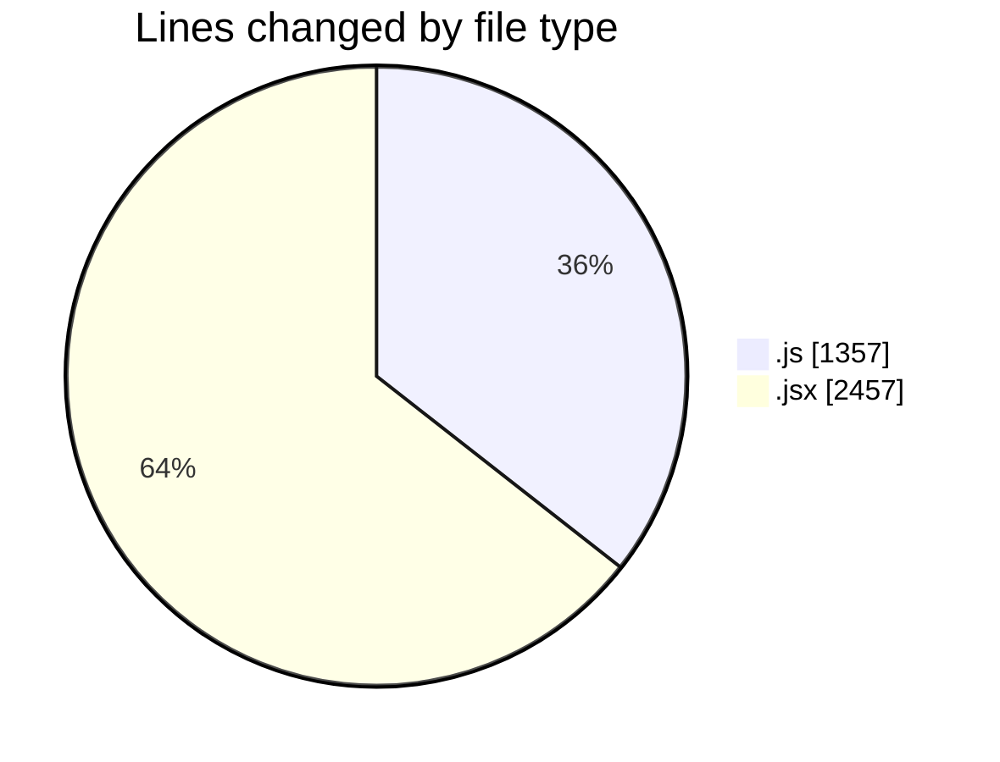
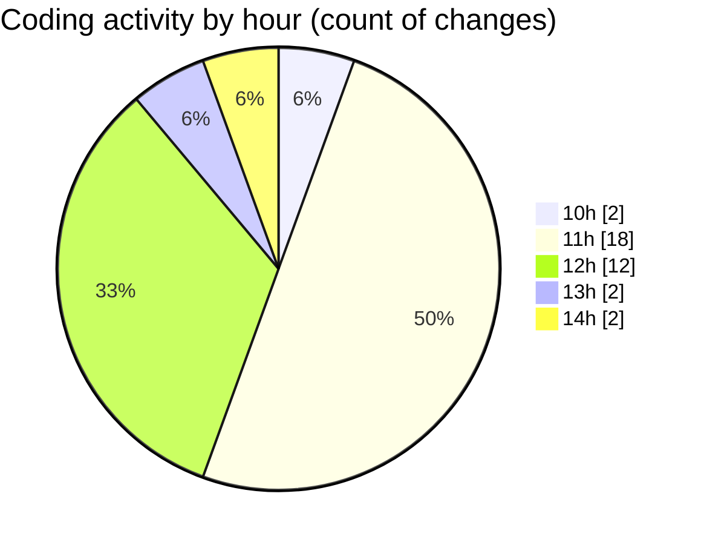

# nxtqube_webapp - Activity Summary 

## Overall Statistics

| Stat                   | Value                                                             |
| ---------------------- | ----------------------------------------------------------------- |
| **Lines Added** (➕)   | 3665                                          |
| **Lines Removed** (➖) | 149                                        |
| **Net Change** (↕)    | 3516                |
| **Active Time** (⌚)   | 44 minutes |

## Modified Files
- **useMissionDisplay.js** (+683, -1)
- **deleteLastWaypoint.js** (+189, -91)
- **Map.jsx** (+558, -0)
- **HandleAddWaypointOnclick.js** (+393, -0)
- **ExistingMission.jsx** (+457, -57)
- **MissionInfo.jsx** (+542, -0)
- **WaypointAction.jsx** (+321, -0)
- **createMissionHome.jsx** (+522, -0)

## Visualizations

### By File Type (Lines Changed)

### By Hour (Estimated Activity Count)

> **Last Updated:** 05/08/2025, 14:32:18