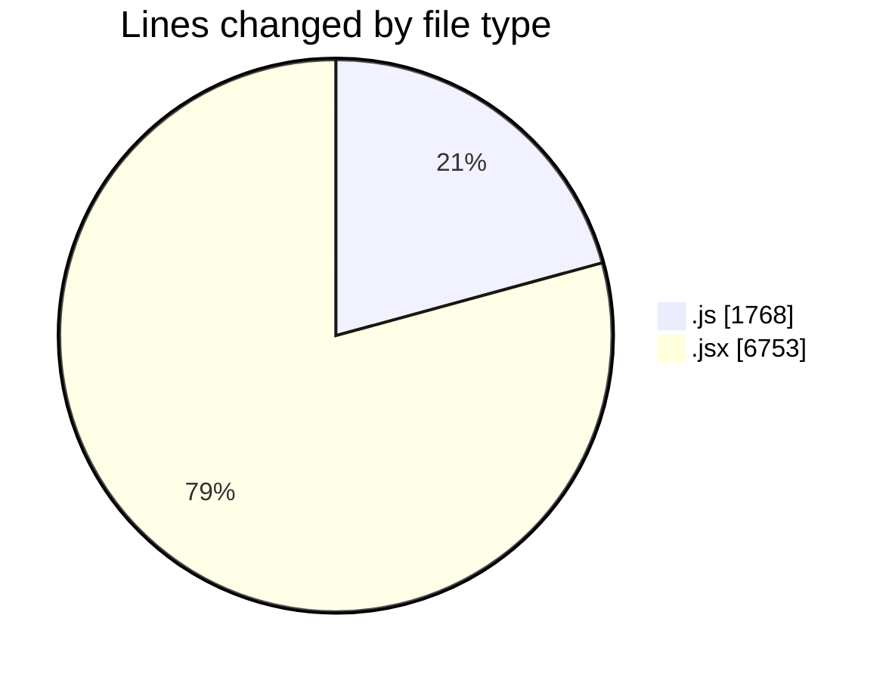
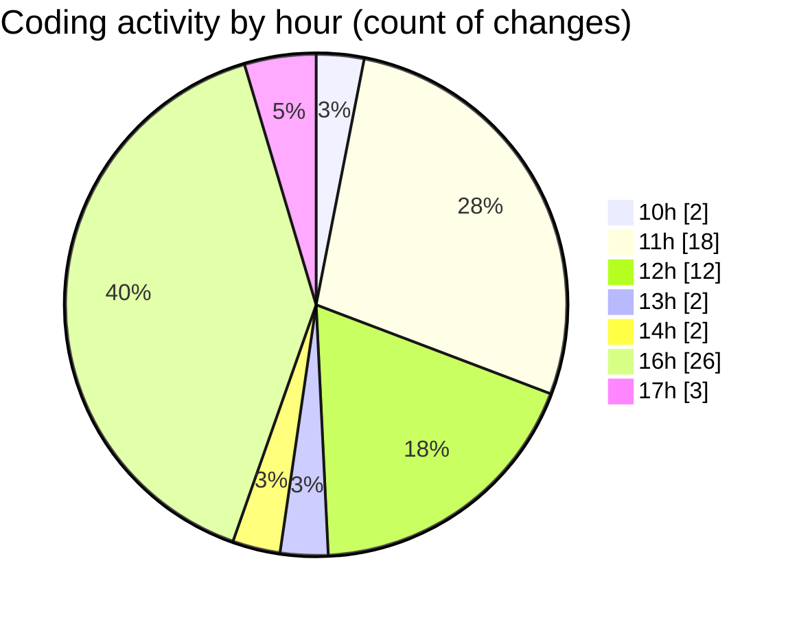

# nxtqube_webapp - Activity Summary 

## Overall Statistics

| Stat                   | Value                                                             |
| ---------------------- | ----------------------------------------------------------------- |
| **Lines Added** (➕)   | 7142                                          |
| **Lines Removed** (➖) | 1379                                        |
| **Net Change** (↕)    | 5763                |
| **Active Time** (⌚)   | 74 minutes |

## Modified Files
- **useMissionDisplay.js** (+683, -1)
- **deleteLastWaypoint.js** (+189, -91)
- **Map.jsx** (+558, -0)
- **HandleAddWaypointOnclick.js** (+393, -0)
- **ExistingMission.jsx** (+457, -57)
- **MissionInfo.jsx** (+542, -0)
- **WaypointAction.jsx** (+321, -0)
- **createMissionHome.jsx** (+522, -0)
- **geofence.jsx** (+317, -139)
- **useGeofenceForm.js** (+234, -0)
- **formValidation.js** (+104, -0)
- **useFormValidation.js** (+73, -0)
- **LoadingSpinner.jsx** (+58, -0)
- **ErrorBoundary.jsx** (+88, -0)
- **GeofenceHeader.jsx** (+79, -0)
- **GeofenceFormContainer.jsx** (+116, -0)
- **CreateFenceForm.jsx** (+924, -556)
- **ExistingFenceForm.jsx** (+588, -310)
- **LoginPage.jsx** (+446, -141)
- **App.jsx** (+450, -84)

## Visualizations

### By File Type (Lines Changed)

### By Hour (Estimated Activity Count)

> **Last Updated:** 05/08/2025, 17:18:02