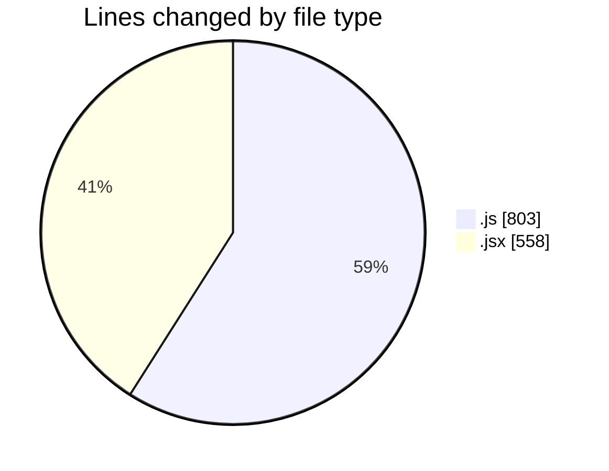
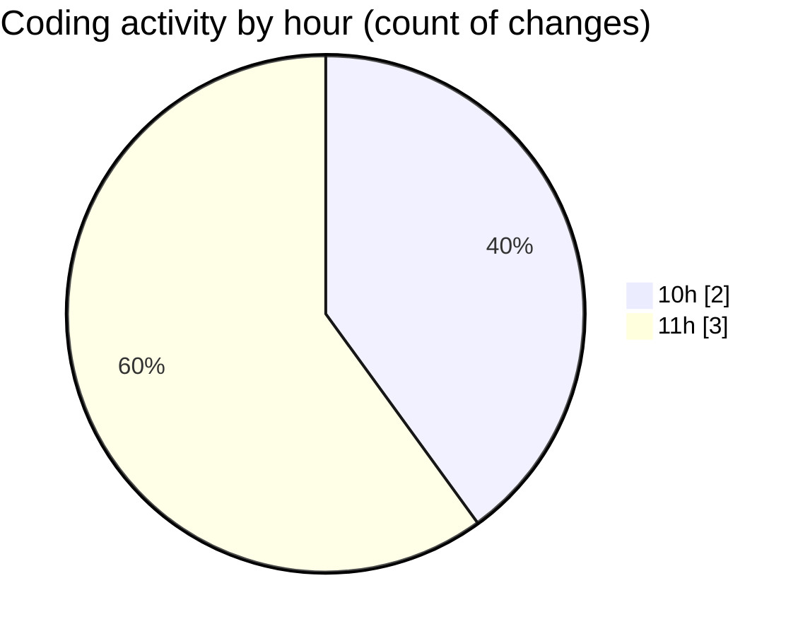

# nxtqube_webapp - Activity Summary 

## Overall Statistics

| Stat                   | Value                                                             |
| ---------------------- | ----------------------------------------------------------------- |
| **Lines Added** (➕)   | 1361                                          |
| **Lines Removed** (➖) | 0                                        |
| **Net Change** (↕)    | 1361                |
| **Active Time** (⌚)   | 3 minutes |

## Modified Files
- **useMissionDisplay.js** (+671, -0)
- **deleteLastWaypoint.js** (+132, -0)
- **Map.jsx** (+558, -0)

## Visualizations

### By File Type (Lines Changed)

### By Hour (Estimated Activity Count)

> **Last Updated:** 05/08/2025, 11:07:15