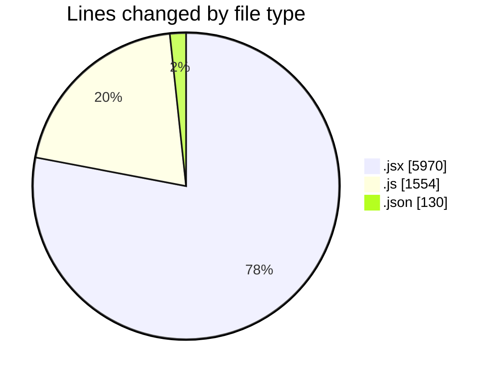
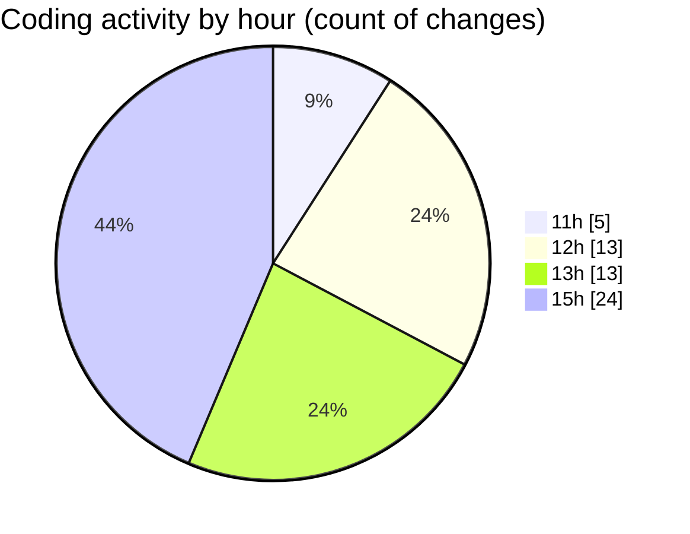

# nxtqube_webapp - Activity Summary 

## Overall Statistics

| Stat                   | Value                                                             |
| ---------------------- | ----------------------------------------------------------------- |
| **Lines Added** (➕)   | 7492                                          |
| **Lines Removed** (➖) | 162                                        |
| **Net Change** (↕)    | 7330                |
| **Active Time** (⌚)   | 60 minutes |

## Modified Files
- **MissionInfo.jsx** (+542, -0)
- **ExistingFenceForm.jsx** (+554, -0)
- **checkgeofenc.js** (+236, -0)
- **fenceData.controller.js** (+360, -0)
- **settings.json** (+63, -3)
- **Map.jsx** (+1739, -61)
- **geofence.jsx** (+319, -3)
- **CreateFenceForm.jsx** (+2752, -0)
- **useFenceManagement.js** (+864, -94)
- **settings.json** (+63, -1)

## Visualizations

### By File Type (Lines Changed)

### By Hour (Estimated Activity Count)

> **Last Updated:** 06/08/2025, 15:55:14