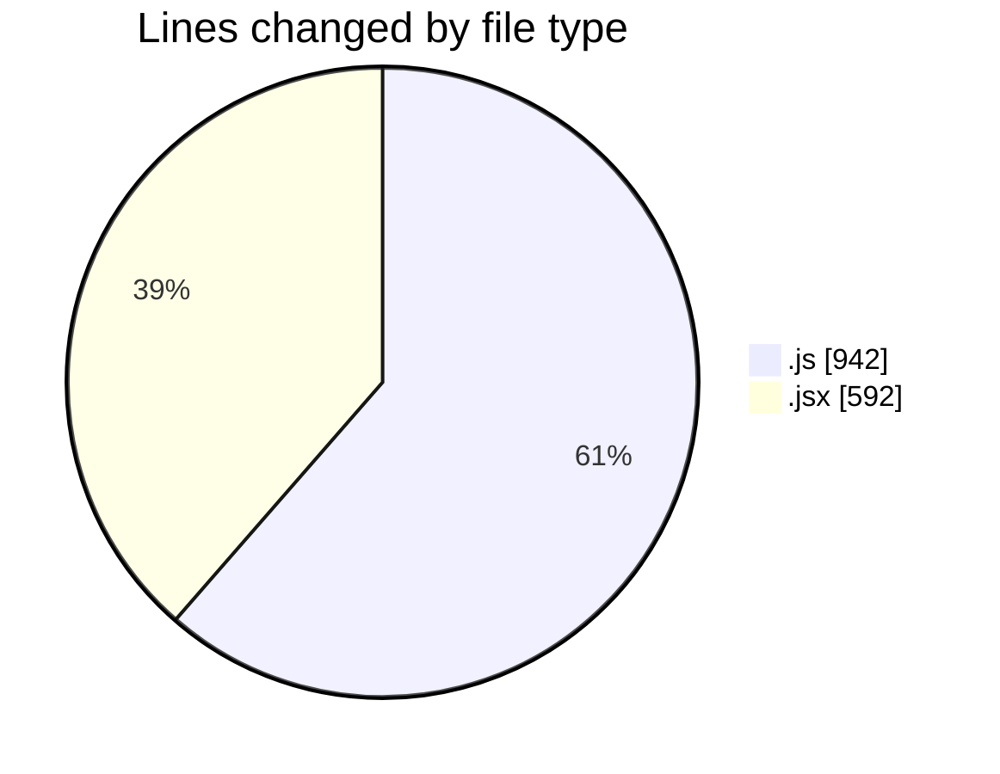
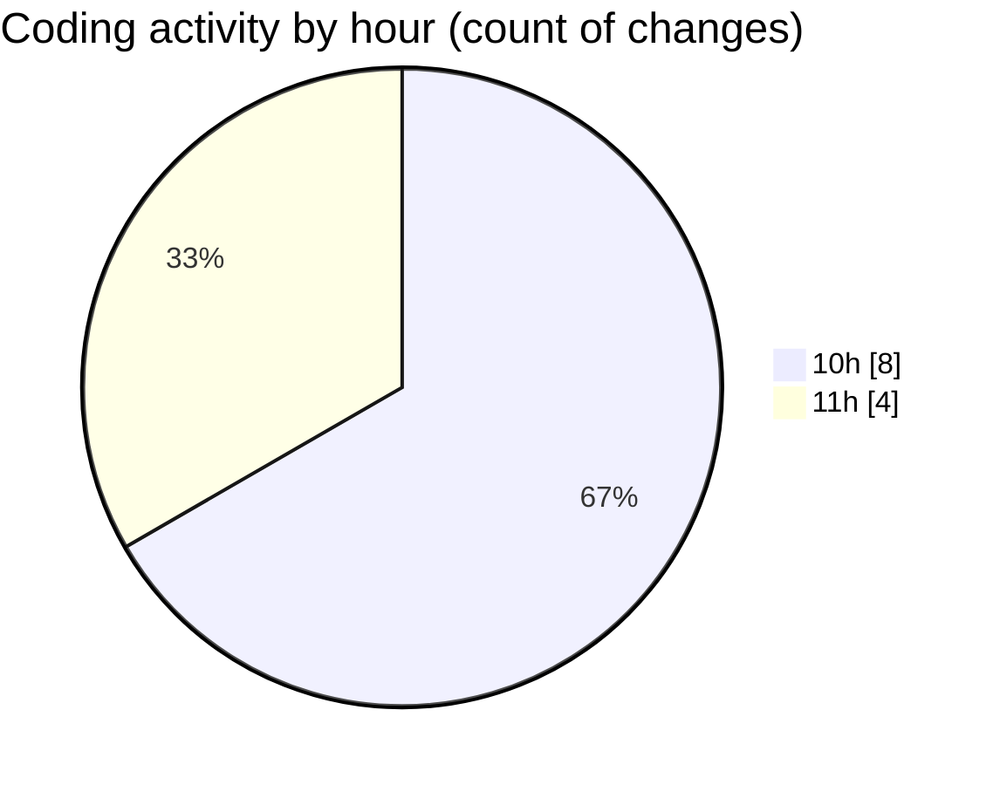

# nxtqube_webapp - Activity Summary 

## Overall Statistics

| Stat                   | Value                                                             |
| ---------------------- | ----------------------------------------------------------------- |
| **Lines Added** (➕)   | 1526                                          |
| **Lines Removed** (➖) | 8                                        |
| **Net Change** (↕)    | 1518                |
| **Active Time** (⌚)   | 10 minutes |

## Modified Files
- **drawMission.js** (+380, -0)
- **removeEntities.js** (+89, -0)
- **Map.jsx** (+588, -4)
- **useFenceManagement.js** (+469, -4)

## Visualizations

### By File Type (Lines Changed)

### By Hour (Estimated Activity Count)

> **Last Updated:** 07/08/2025, 11:56:08