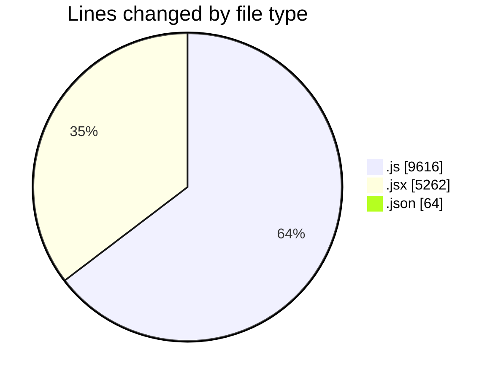
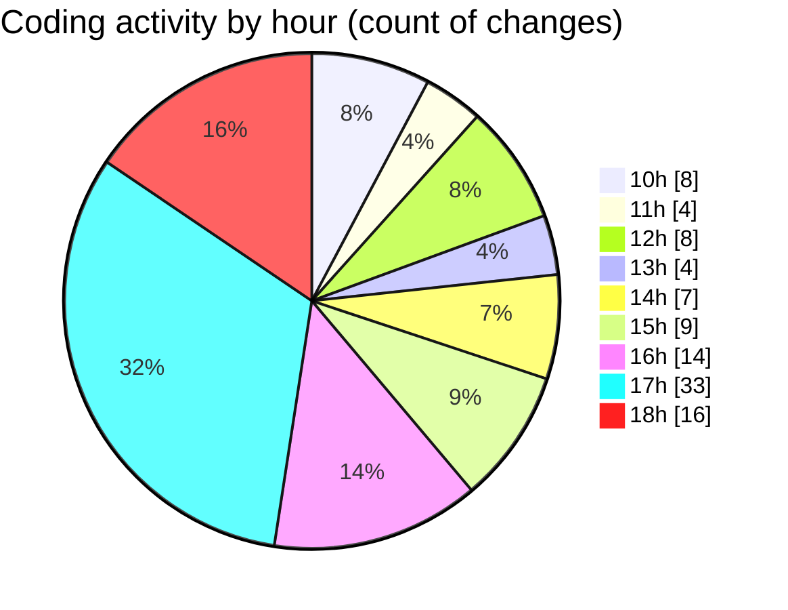

# nxtqube_webapp - Activity Summary 

## Overall Statistics

| Stat                   | Value                                                             |
| ---------------------- | ----------------------------------------------------------------- |
| **Lines Added** (➕)   | 8794                                          |
| **Lines Removed** (➖) | 6148                                        |
| **Net Change** (↕)    | 2646                |
| **Active Time** (⌚)   | 131 minutes |

## Modified Files
- **drawMission.js** (+380, -0)
- **removeEntities.js** (+89, -0)
- **Map.jsx** (+2423, -1824)
- **useFenceManagement.js** (+4875, -4272)
- **CreateFenceForm.jsx** (+965, -50)
- **settings.json** (+62, -2)

## Visualizations

### By File Type (Lines Changed)

### By Hour (Estimated Activity Count)

> **Last Updated:** 07/08/2025, 18:29:29