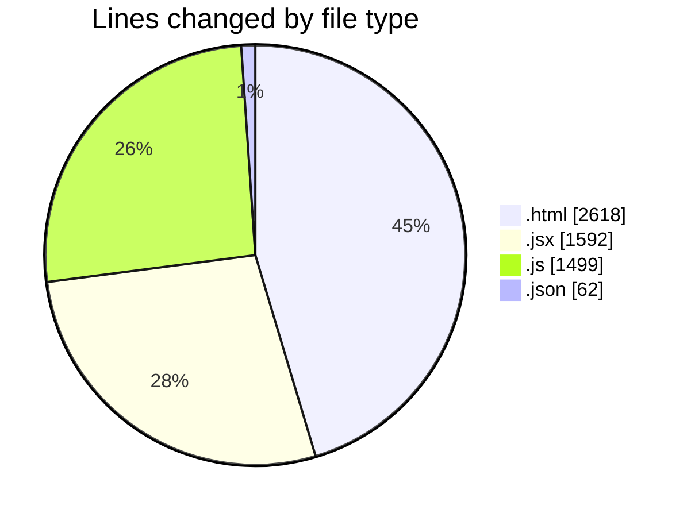
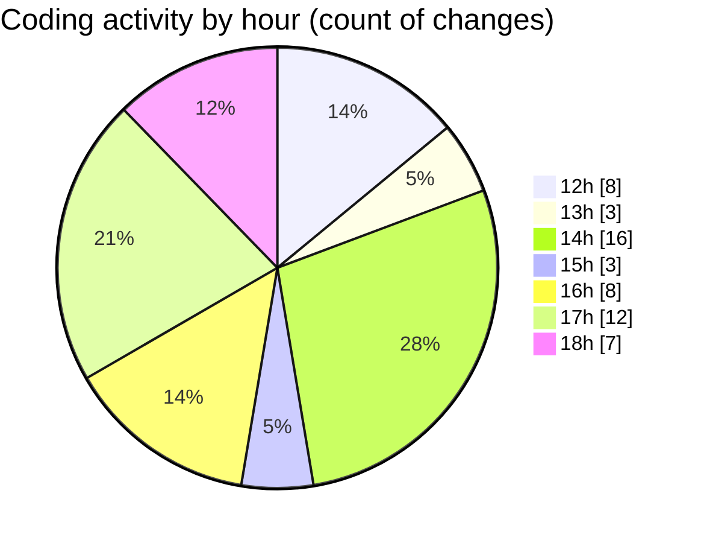

# nxtqube_webapp - Activity Summary 

## Overall Statistics

| Stat                   | Value                                                             |
| ---------------------- | ----------------------------------------------------------------- |
| **Lines Added** (➕)   | 4539                                          |
| **Lines Removed** (➖) | 1232                                        |
| **Net Change** (↕)    | 3307                |
| **Active Time** (⌚)   | 70 minutes |

## Modified Files
- **index (1).html** (+1515, -1103)
- **CreateFenceForm.jsx** (+925, -15)
- **Map.jsx** (+643, -9)
- **useFenceManagement.js** (+1089, -39)
- **settings.json** (+61, -1)
- **polygonFence.js** (+306, -65)

## Visualizations

### By File Type (Lines Changed)

### By Hour (Estimated Activity Count)

> **Last Updated:** 08/08/2025, 18:04:27