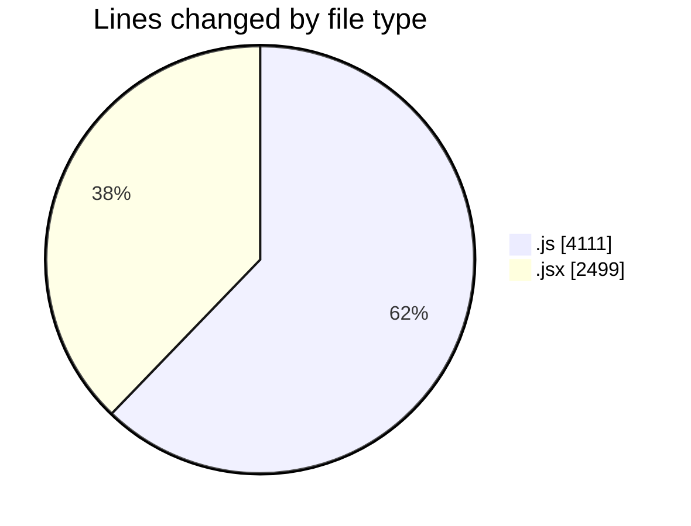
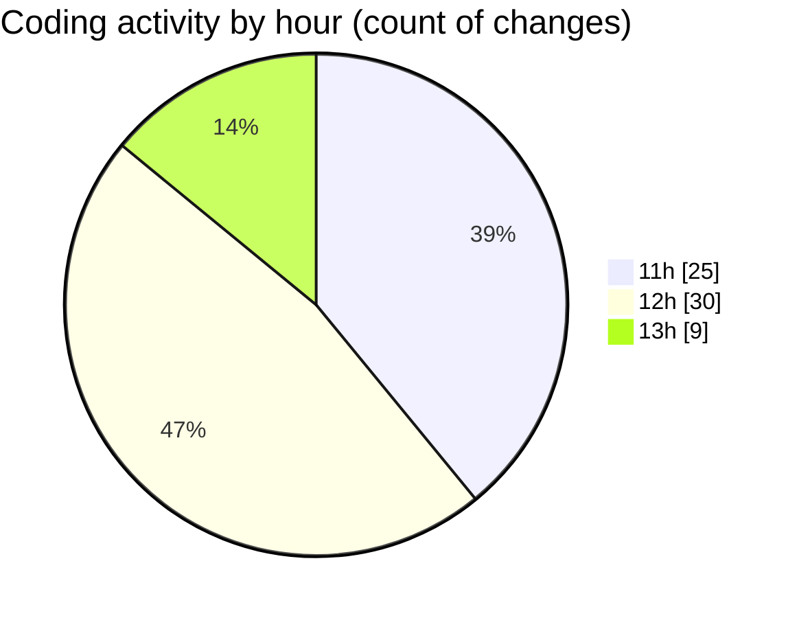

# nxtqube_webapp - Activity Summary 

## Overall Statistics

| Stat                   | Value                                                             |
| ---------------------- | ----------------------------------------------------------------- |
| **Lines Added** (➕)   | 5726                                          |
| **Lines Removed** (➖) | 884                                        |
| **Net Change** (↕)    | 4842                |
| **Active Time** (⌚)   | 88 minutes |

## Modified Files
- **useFenceManagement.js** (+3290, -821)
- **Map.jsx** (+652, -1)
- **geofence.jsx** (+336, -0)
- **ExistingFenceForm.jsx** (+560, -62)
- **CreateFenceForm.jsx** (+888, -0)

## Visualizations

### By File Type (Lines Changed)

### By Hour (Estimated Activity Count)

> **Last Updated:** 13/08/2025, 13:23:31