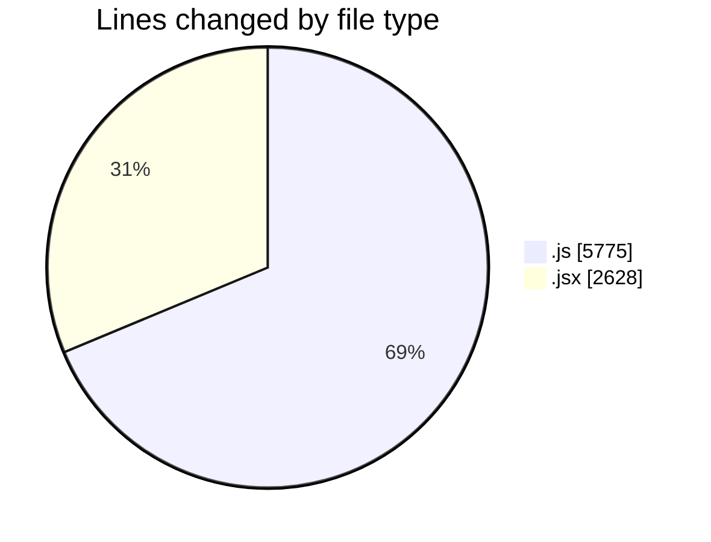
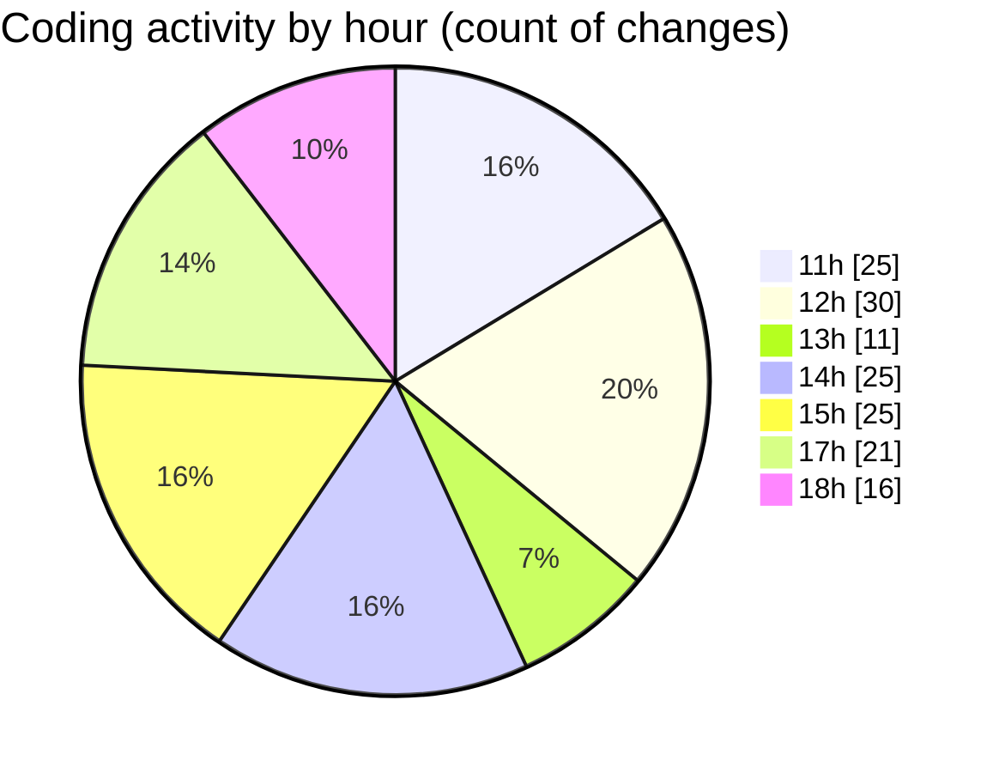

# nxtqube_webapp - Activity Summary 

## Overall Statistics

| Stat                   | Value                                                             |
| ---------------------- | ----------------------------------------------------------------- |
| **Lines Added** (➕)   | 6848                                          |
| **Lines Removed** (➖) | 1555                                        |
| **Net Change** (↕)    | 5293                |
| **Active Time** (⌚)   | 214 minutes |

## Modified Files
- **useFenceManagement.js** (+3970, -1461)
- **Map.jsx** (+656, -1)
- **geofence.jsx** (+351, -9)
- **ExistingFenceForm.jsx** (+560, -62)
- **CreateFenceForm.jsx** (+974, -15)
- **polygonFence.js** (+248, -7)
- **removeEntities.js** (+89, -0)

## Visualizations

### By File Type (Lines Changed)

### By Hour (Estimated Activity Count)

> **Last Updated:** 13/08/2025, 18:26:08