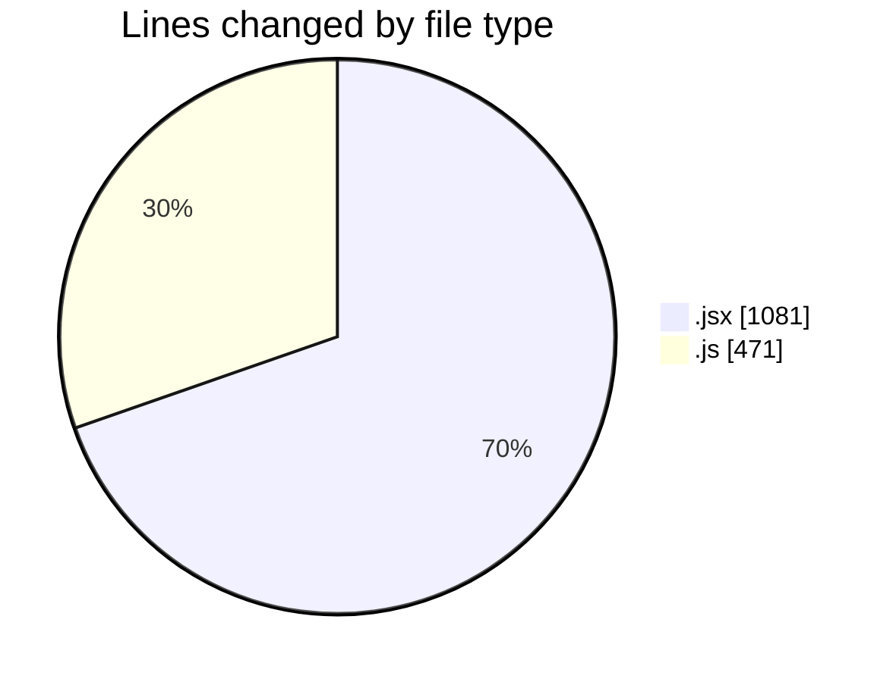
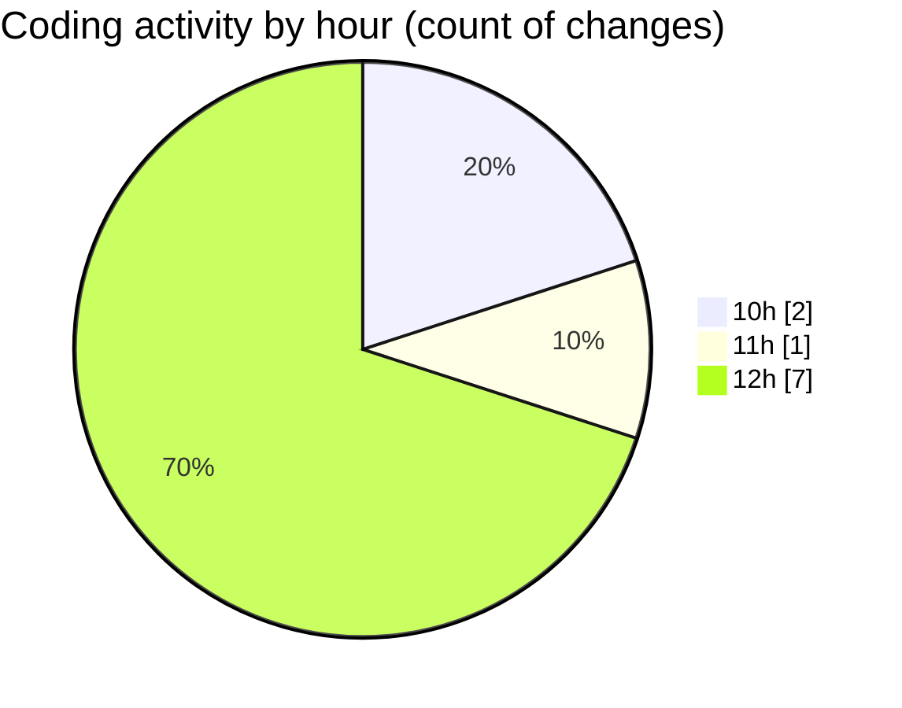

# nxtqube_webapp - Activity Summary 

## Overall Statistics

| Stat                   | Value                                                             |
| ---------------------- | ----------------------------------------------------------------- |
| **Lines Added** (➕)   | 1549                                          |
| **Lines Removed** (➖) | 3                                        |
| **Net Change** (↕)    | 1546                |
| **Active Time** (⌚)   | 15 minutes |

## Modified Files
- **Map.jsx** (+667, -2)
- **useMapInteractions.js** (+66, -0)
- **CreateAnnotation.jsx** (+412, -0)
- **HandleAddWaypointOnclick.js** (+404, -1)

## Visualizations

### By File Type (Lines Changed)

### By Hour (Estimated Activity Count)

> **Last Updated:** 18/08/2025, 12:11:56