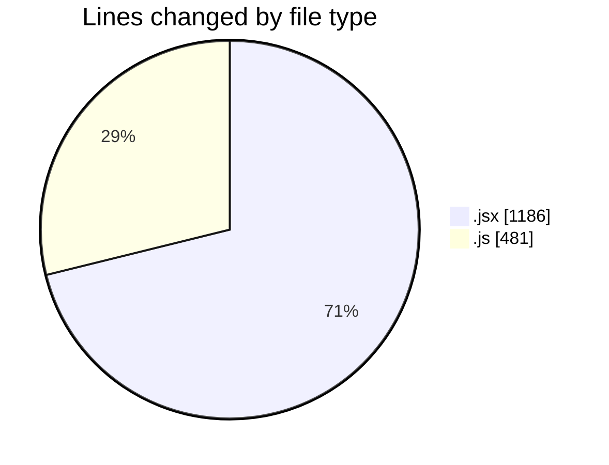
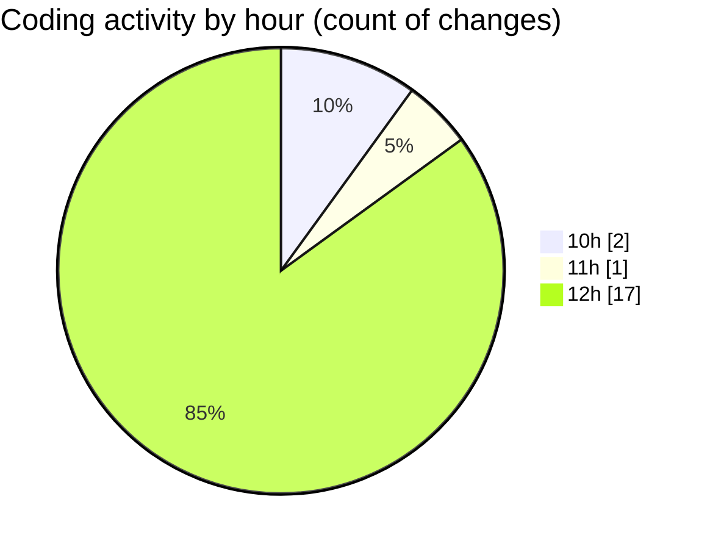

# nxtqube_webapp - Activity Summary 

## Overall Statistics

| Stat                   | Value                                                             |
| ---------------------- | ----------------------------------------------------------------- |
| **Lines Added** (➕)   | 1647                                          |
| **Lines Removed** (➖) | 20                                        |
| **Net Change** (↕)    | 1627                |
| **Active Time** (⌚)   | 28 minutes |

## Modified Files
- **Map.jsx** (+675, -3)
- **useMapInteractions.js** (+66, -0)
- **CreateAnnotation.jsx** (+412, -0)
- **HandleAddWaypointOnclick.js** (+409, -6)
- **Annotations.jsx** (+85, -11)

## Visualizations

### By File Type (Lines Changed)

### By Hour (Estimated Activity Count)

> **Last Updated:** 18/08/2025, 12:41:56