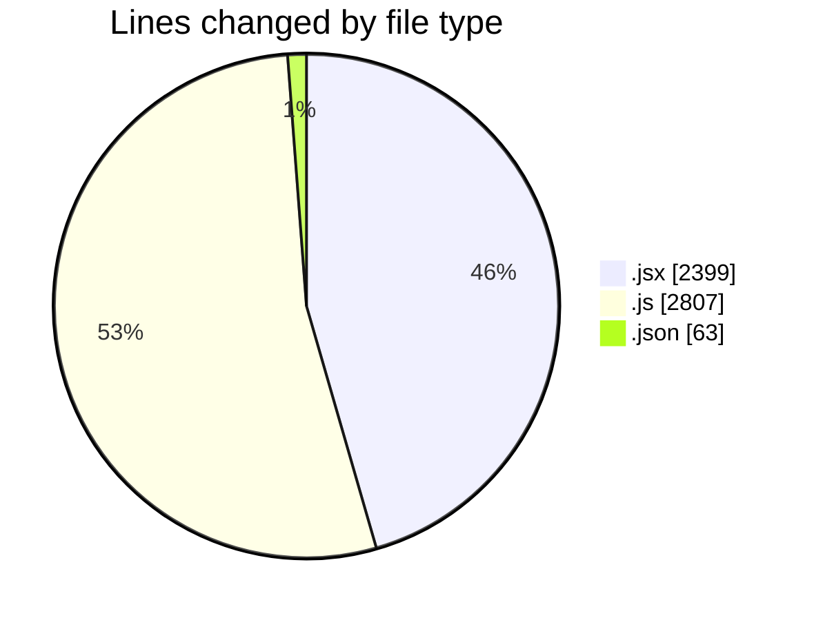
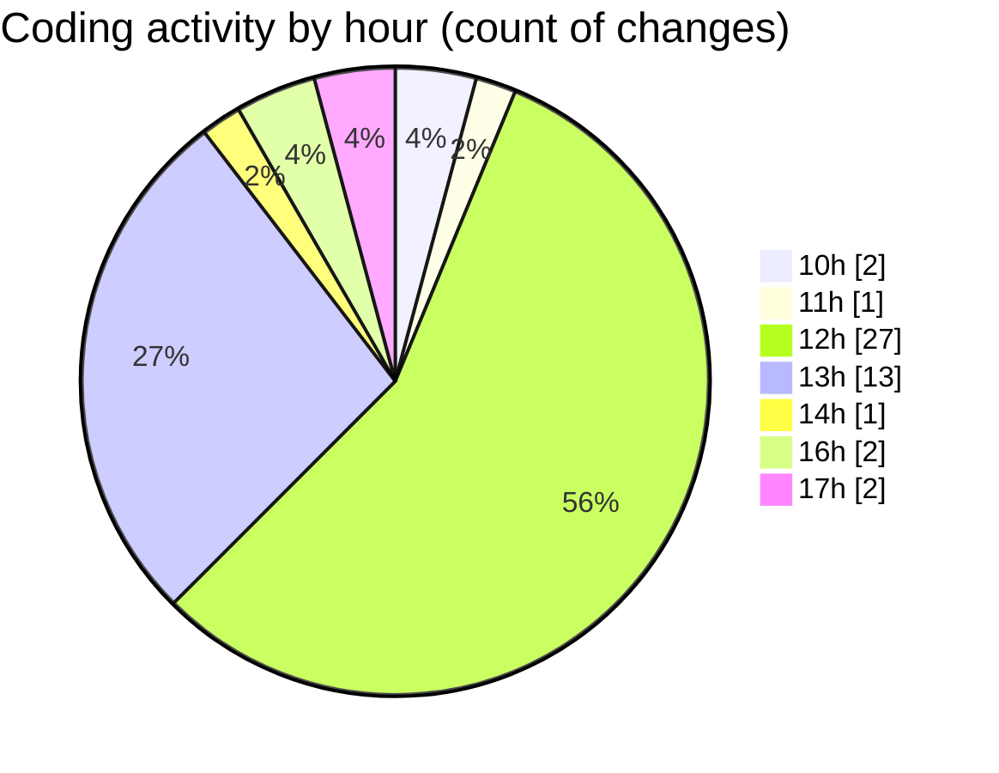

# nxtqube_webapp - Activity Summary 

## Overall Statistics

| Stat                   | Value                                                             |
| ---------------------- | ----------------------------------------------------------------- |
| **Lines Added** (➕)   | 5225                                          |
| **Lines Removed** (➖) | 44                                        |
| **Net Change** (↕)    | 5181                |
| **Active Time** (⌚)   | 50 minutes |

## Modified Files
- **Map.jsx** (+704, -23)
- **useMapInteractions.js** (+66, -0)
- **CreateAnnotation.jsx** (+412, -0)
- **HandleAddWaypointOnclick.js** (+410, -6)
- **Annotations.jsx** (+85, -11)
- **settings.json** (+63, -0)
- **Mission.jsx** (+116, -0)
- **useFenceManagement.js** (+2325, -0)
- **MissionInfo.jsx** (+546, -4)
- **ExistingFenceForm.jsx** (+498, -0)

## Visualizations

### By File Type (Lines Changed)

### By Hour (Estimated Activity Count)

> **Last Updated:** 18/08/2025, 17:45:01