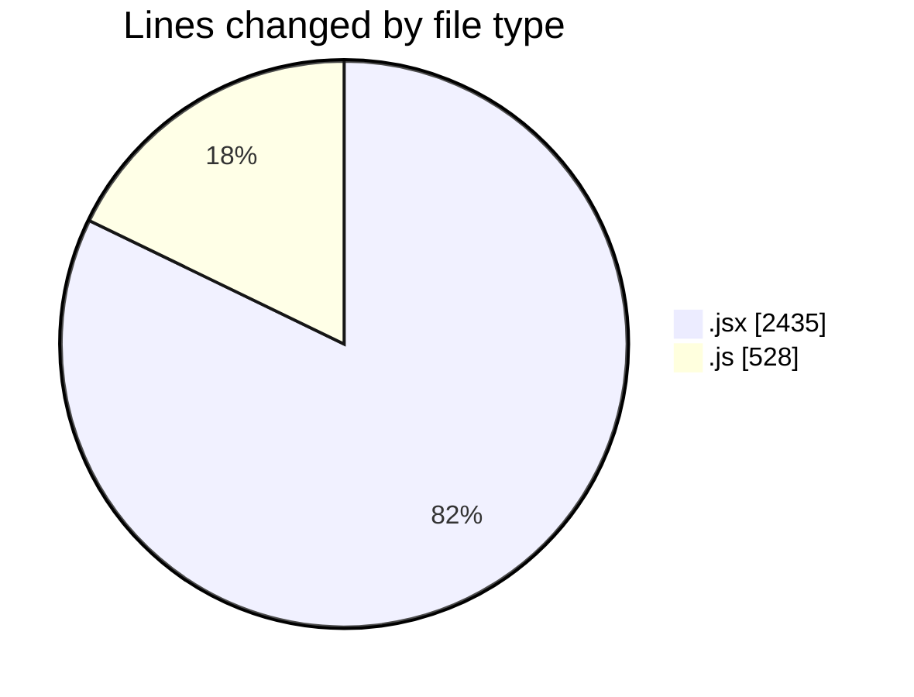
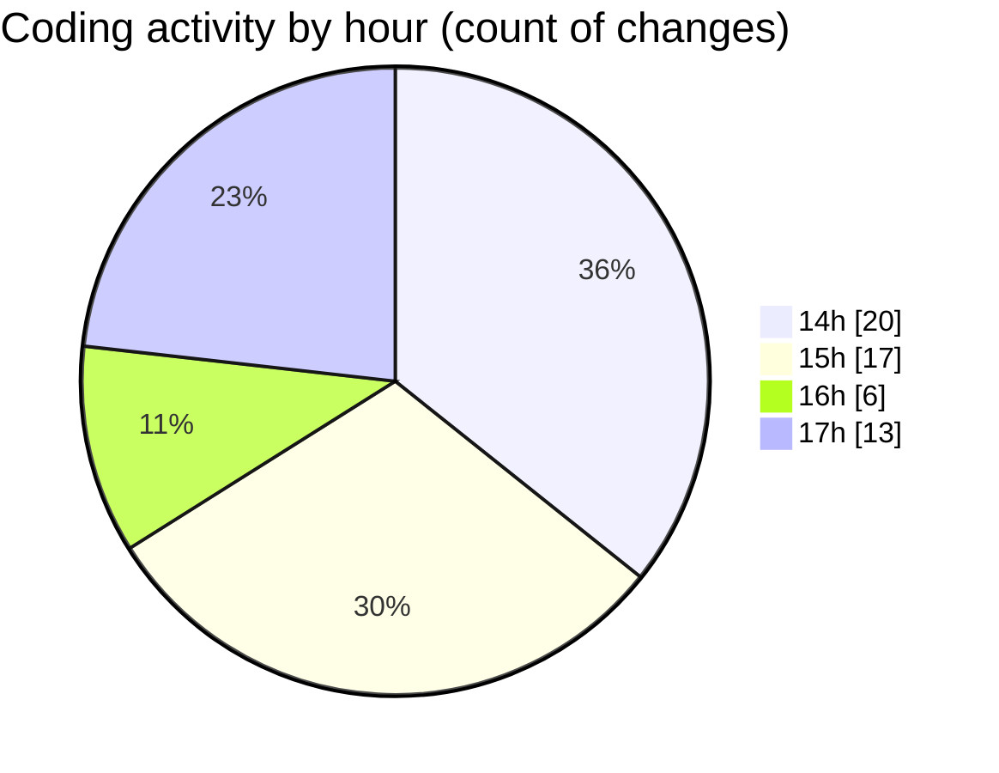

# nxtqube_webapp - Activity Summary 

## Overall Statistics

| Stat                   | Value                                                             |
| ---------------------- | ----------------------------------------------------------------- |
| **Lines Added** (➕)   | 2688                                          |
| **Lines Removed** (➖) | 275                                        |
| **Net Change** (↕)    | 2413                |
| **Active Time** (⌚)   | 78 minutes |

## Modified Files
- **createGridMission.jsx** (+109, -0)
- **createMissionHome.jsx** (+562, -7)
- **createPathMission.jsx** (+107, -0)
- **MissionInfo.jsx** (+543, -0)
- **ManageMission.jsx** (+281, -0)
- **Mission.jsx** (+119, -0)
- **Map.jsx** (+701, -6)
- **drawGrid.js** (+266, -262)

## Visualizations

### By File Type (Lines Changed)

### By Hour (Estimated Activity Count)

> **Last Updated:** 26/08/2025, 17:26:33