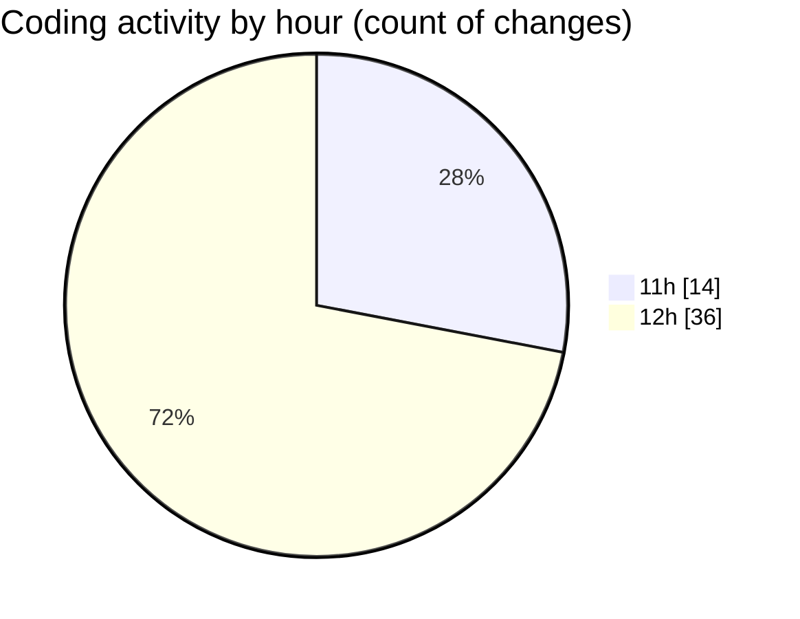

# nxtqube_webapp - Activity Summary 

## Overall Statistics

| Stat                   | Value                                                             |
| ---------------------- | ----------------------------------------------------------------- |
| **Lines Added** (➕)   | 2452                                          |
| **Lines Removed** (➖) | 39                                        |
| **Net Change** (↕)    | 2413                |
| **Active Time** (⌚)   | 58 minutes |

## Modified Files
- **drawGrid.js** (+421, -1)
- **createGridMission.jsx** (+246, -24)
- **Mission.jsx** (+162, -8)
- **Map.jsx** (+737, -6)
- **ManageMission.jsx** (+307, -0)
- **createMissionHome.jsx** (+579, -0)

## Visualizations

### By File Type (Lines Changed)

### By Hour (Estimated Activity Count)

> **Last Updated:** 28/08/2025, 12:50:53