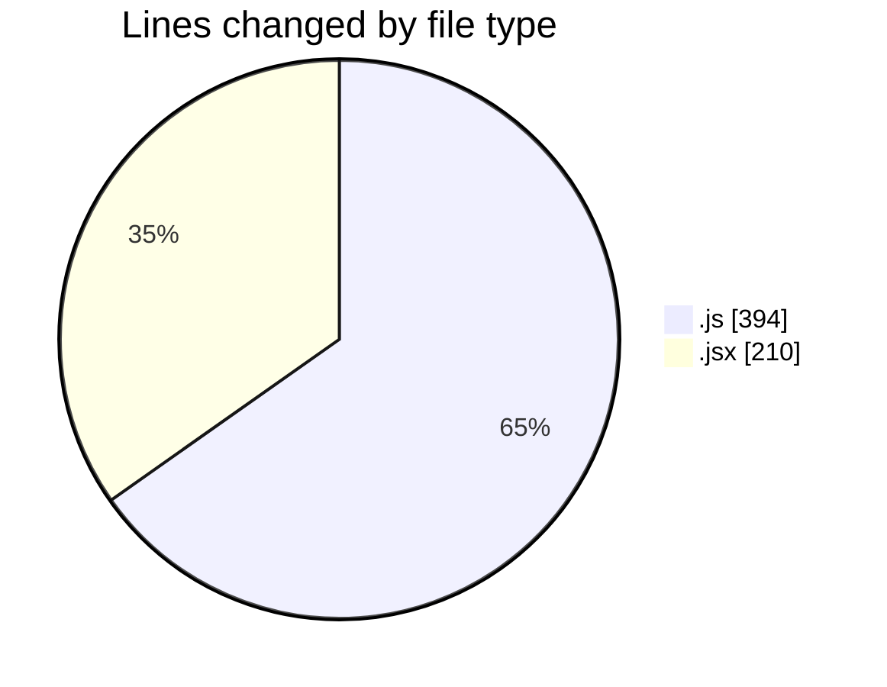
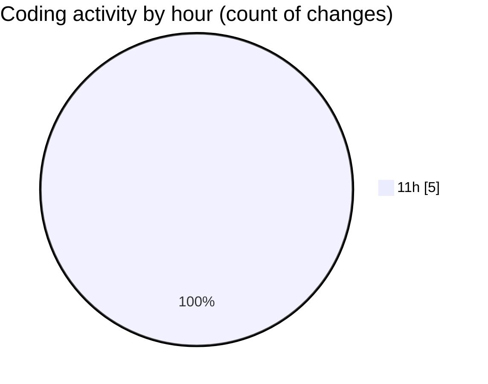

# nxtqube_webapp - Activity Summary 

## Overall Statistics

| Stat                   | Value                                                             |
| ---------------------- | ----------------------------------------------------------------- |
| **Lines Added** (➕)   | 604                                          |
| **Lines Removed** (➖) | 0                                        |
| **Net Change** (↕)    | 604                |
| **Active Time** (⌚)   | 8 minutes |

## Modified Files
- **drawGrid.js** (+394, -0)
- **createGridMission.jsx** (+210, -0)

## Visualizations

### By File Type (Lines Changed)

### By Hour (Estimated Activity Count)

> **Last Updated:** 28/08/2025, 11:40:45