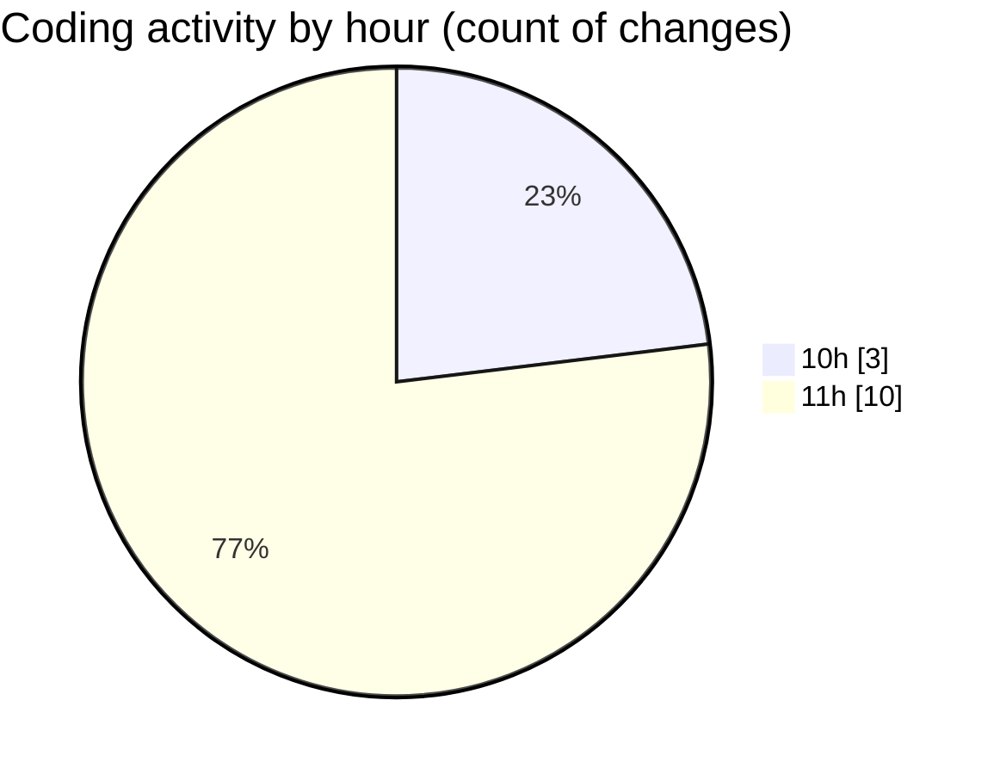

# nxtqube_webapp - Activity Summary 

## Overall Statistics

| Stat                   | Value                                                             |
| ---------------------- | ----------------------------------------------------------------- |
| **Lines Added** (➕)   | 1596                                          |
| **Lines Removed** (➖) | 6                                        |
| **Net Change** (↕)    | 1590                |
| **Active Time** (⌚)   | 15 minutes |

## Modified Files
- **drawGrid.js** (+730, -1)
- **Mission.jsx** (+155, -5)
- **Map.jsx** (+711, -0)

## Visualizations

### By File Type (Lines Changed)

### By Hour (Estimated Activity Count)

> **Last Updated:** 29/08/2025, 11:35:55