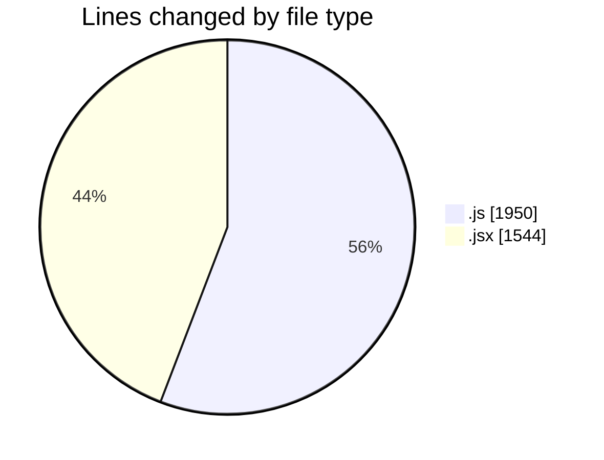
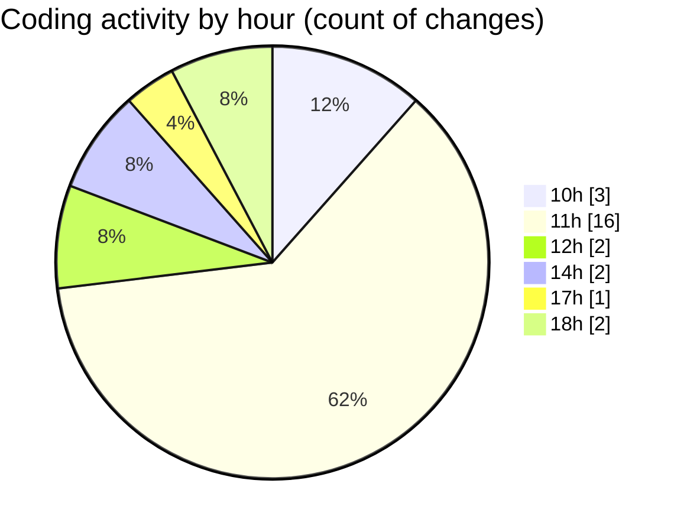

# nxtqube_webapp - Activity Summary 

## Overall Statistics

| Stat                   | Value                                                             |
| ---------------------- | ----------------------------------------------------------------- |
| **Lines Added** (➕)   | 3480                                          |
| **Lines Removed** (➖) | 14                                        |
| **Net Change** (↕)    | 3466                |
| **Active Time** (⌚)   | 23 minutes |

## Modified Files
- **drawGrid.js** (+1943, -7)
- **Mission.jsx** (+163, -5)
- **Map.jsx** (+711, -0)
- **createGridMission.jsx** (+663, -2)

## Visualizations

### By File Type (Lines Changed)

### By Hour (Estimated Activity Count)

> **Last Updated:** 29/08/2025, 18:16:07