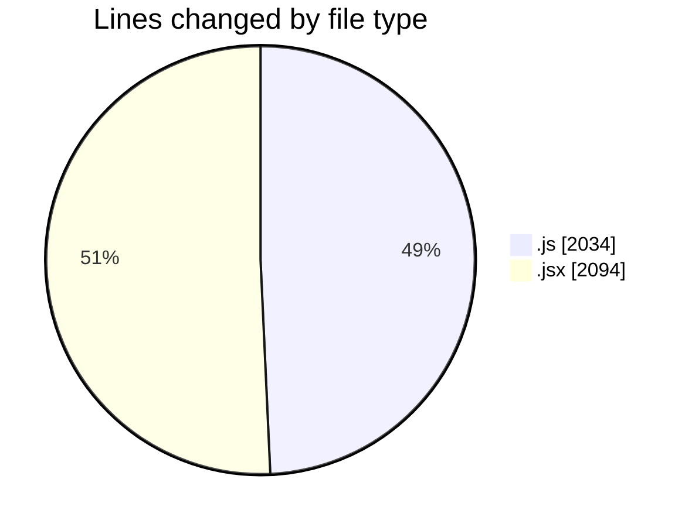
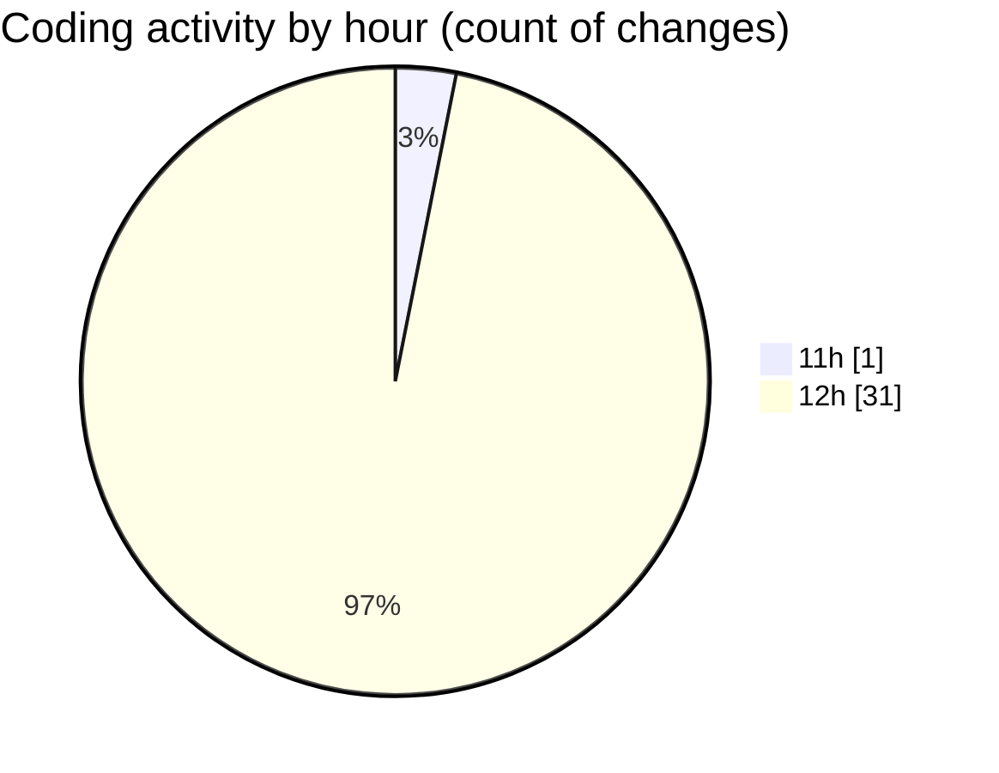

# nxtqube_webapp - Activity Summary 

## Overall Statistics

| Stat                   | Value                                                             |
| ---------------------- | ----------------------------------------------------------------- |
| **Lines Added** (➕)   | 3318                                          |
| **Lines Removed** (➖) | 810                                        |
| **Net Change** (↕)    | 2508                |
| **Active Time** (⌚)   | 39 minutes |

## Modified Files
- **drawGrid.js** (+1224, -810)
- **Map.jsx** (+714, -0)
- **Mission.jsx** (+158, -0)
- **ManageMission.jsx** (+307, -0)
- **createMissionHome.jsx** (+579, -0)
- **createGridMission.jsx** (+336, -0)

## Visualizations

### By File Type (Lines Changed)

### By Hour (Estimated Activity Count)

> **Last Updated:** 01/09/2025, 12:50:21